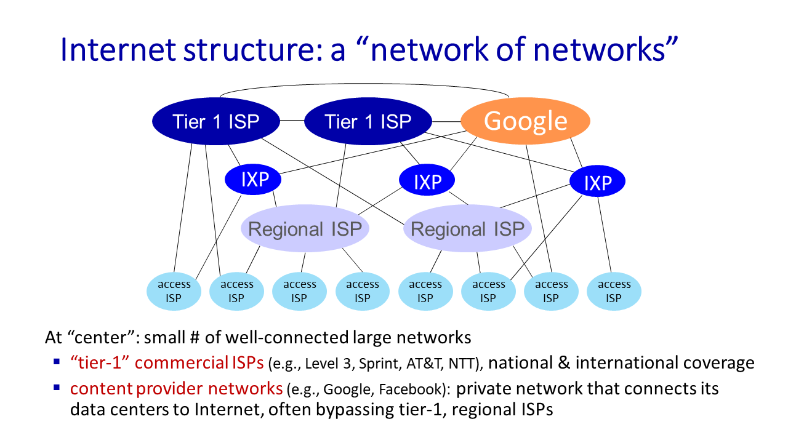
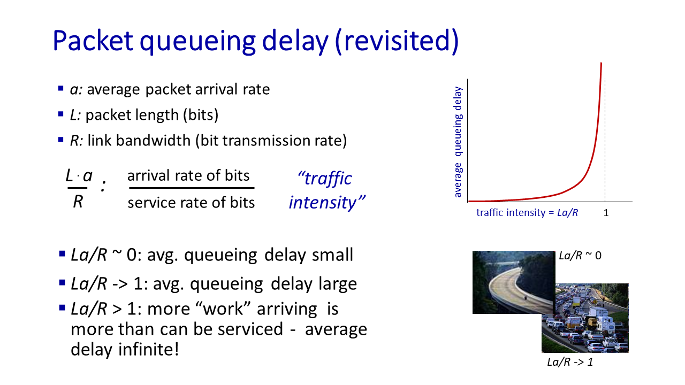
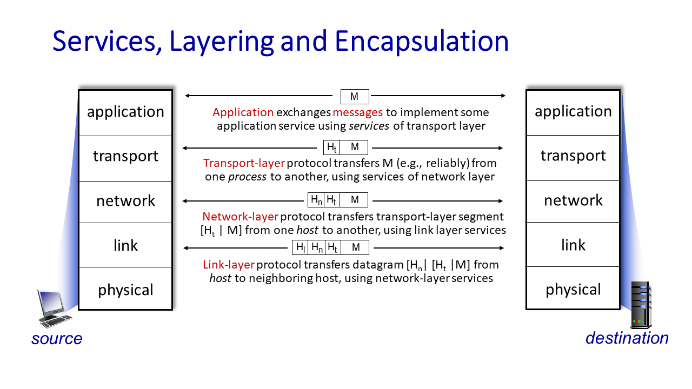
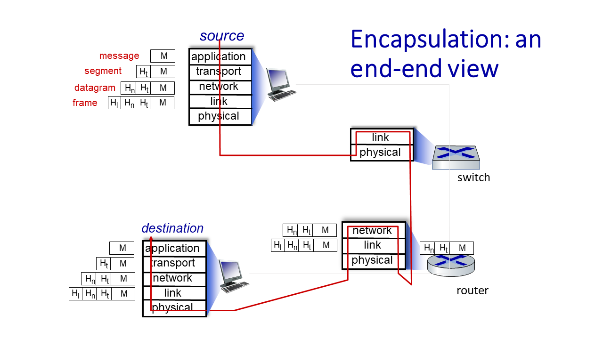

# COMPSCI 453 

## chapter1-Computer Networks and the Internet

### 1.1_What is the Internet

<u>§Introduction. What *is* the Internet? What *is* a protocol?</u>

Internet is network of networks

*Protocols* *define the* *format**,* *order* *of* *messages sent and received* *among network entities, and* *actions taken* *on message transmission, receipt* 

### 1.2_Network edge

*A closer look at Internet structure*

- *Network edge:*

  - ***hosts: clients and servers***

  - *servers often in data centers*

- *Access networks, physical media:*

  - *wired, wireless communication links*

- *Network core:* 

  - *interconnected routers*
  - *network of networks*

host sending function:

- takes application message
- breaks into smaller chunks, known as *packets*, of length *L* bits
- transmits packet into access network at *transmission rate R*
  - link transmission rate, aka link *capacity, aka link bandwidth*

$$
packet Transmission Delay=time Needed To Transmit Lbit
Packet Into Link=\frac{L_{(bits)}}{R_{(bits/sec)}}
$$

### 1.3_Network Core

<u>§Network core: packet/circuit switching, internet structure</u>

- forwarding,routing
- packet switching
- circuit switching
- structure of today's internet

#### The network core

1. mesh of interconnected routers

2. packet-switching: hosts break application-layer messages into *packets*
   1. network forwards packets from one router to the next, across links on path from source to destination

#### Two key network-core functions

*Forwarding:* 

- aka “switching”

- *local* action: move arriving packets from router’s input link to appropriate router output link

*Routing:*

- *global* action: determine source-destination paths taken by packets

- routing algorithms

#### Packet-switching（分组交换）

[分组](https://zh.wikipedia.org/wiki/網路封包)[[注 1\]](https://zh.wikipedia.org/wiki/封包交換#cite_note-1)（又称消息、或消息碎片）在[节点](https://zh.wikipedia.org/wiki/节点_(电信网络))间单独[路由](https://zh.wikipedia.org/wiki/路由)，不需要在传输前先建立通信路径。

**store-and-forward**

- packet transmission delay: takes *L*/*R* seconds to transmit (push out) *L*-bit packet into link at *R* bps
- *store and forward:* *entire* packet must arrive at router before it can be transmitted on next link

**queueing**

- *Packet queuing and loss:* if arrival rate (in bps) to link exceeds transmission rate (bps) of link for some period of time:
  - packets will queue, waiting to be transmitted on output link 
  - packets can be dropped (lost) if memory (buffer) in router fills up

Alternative to packet switching:**circuit switching**（电路交换）

通信双方需要传递的信息都是通过已经建立好的连接来进行传递的，而且这个连接也将一直被维持到双方的通信结束。

- end-end resources allocated to, reserved for “call” between source and destination
  - FDM(frequency) or TDM(time)

**Packet switching versus circuit switching**

- great for “bursty” data – sometimes has data to send, but at other times not
  - resource sharing
  - simpler, no call setup

- excessive congestion possible: packet delay and loss due to buffer overflow
  - protocols needed for reliable data transfer, congestion control

*Q:* How to provide circuit-like behavior with packet-switching?

*A:*“It’s complicated.” We’ll study various techniques that try to make packet switching as “circuit-like” as possible.

报文交换与电路交换相比是将数据划分成更小的单位称为数据包。报文交换可共享多个通信会话的可用网络带宽。 复用在同一物理导体多个电信连接已经很长一段时间，然而每个通道上的复用的链接要么致力于一次通话，或者是闲置之间的通话。 在电路交换，[虚电路](https://zh.wikipedia.org/wiki/虚电路)交换，[路由](https://zh.wikipedia.org/wiki/路由)和[带宽](https://zh.wikipedia.org/wiki/带宽)预留从源到目的地。电路交换可以相对低效的，因为能力是保证建立连接，但不连续使用，而是暂时的。然而，连接是立即可用，同时成立。 报文交换是分割的消息/被分成几个较小的[数据包](https://zh.wikipedia.org/wiki/数据包)传输数据的过程。每个数据包都标有其目的和订购相关的数据包的序列号，解除需要一个专用的路径，以帮助找到包到其目的地的方式。每个数据包调度独立，每个人都可以通过不同的路径传送。在目的地，原始邮件将被以正确的顺序重组，根据数据包的数量。报文交换网络不需要建立一个电路，并允许许多双[节点](https://zh.wikipedia.org/wiki/节点)同时在同一通道进行通信。

#### Internet structure: a “network of networks”

- hosts connect to Internet via access Internet Service Providers (ISPs)
- access ISPs in turn must be interconnected
  - so that *any* two hosts *(anywhere!)* can send packets to each other

- resulting network of networks is very complex(evolution driven by economics, national policies)

  1. *Option:* *connect each access ISP to one global transit ISP?

  2. But if one global ISP is viable business, there will be competitors ….who will want to be connected
  3. Internet exchange point (IXP)
  4. and regional networks may arise to connect access nets to ISPs 
  5. and content provider networks (e.g., Google, Microsoft, Akamai) may run their own network, to bring services, content close to end users

### 1.4_Performance

<u>§Performance: loss, delay, throughput</u>

- components of network delay
- *traceroute*:looking at network delays
- packet loss
- throughput

#### packet delay

$$
d_{nodal}=d_{proc}+d_{queue}+d_{trans}+d_{drop}
$$

$$d_{proc}$$:nodal processing

- check bit errors
- determine output link
- typically < microsecs

$$d_{queue}$$:queueing delay

- time waiting at output link for transmission 
- depends on congestion level of router

$$d_{trans}$$:transmission（宽频传输） delay

- *L*: packet length (bits) 

- *R*: link *transmission rate (bps)*

- $$d_{trans} = \frac{L}{R}$$

$$d_{prop}$$:propagation delay

- *d*: length of physical link

- *s*:propagation speed ($$~2\times10^8 m/sec$$)

- $$d_{prop} = \frac{d}{s}$$

#### packet loss

- *throughput:* rate (bits/time unit) at which bits are being sent from sender to receiver
  - *instantaneous:* rate at given point in time
  
  - *average:* rate over longer period of time
  - the throughput that a source to destination path can receive is going to be limited by the capacity of the thinnest pipe.
  - bottleneck link: link on end-end path that constrains end-end throughput（限制终端吞吐量的链路）

### 1.5_Protocol layers

<u>§Layering, encapsulation, service models</u>

- architectural layering
- Internet layers
- encapsulation

#### Layered Internet protocol stack

5. *application:* supporting network applications
   - HTTP, IMAP, SMTP, DNS

4. *transport:* process-process data transfer
   - TCP, UDP

3. *network:* routing of datagrams from source to destination
   - IP, routing protocols

2. *link:* data transfer between neighboring network elements
   - Ethernet, 802.11 (WiFi), PPP

1. *physical:* bits “on the wire”

#### Services, Layering and Encapsulation

- transport-layer protocol encapsulates application-layer <u>message</u>, $$M$$, with *transport* layer-layer header $$H_t$$ to create a transport-layer <u>segment</u>.
  - $$H_t$$  used by transport layer protocol to implement its service.
- network-layer protocol encapsulates transport-layer segment $$[H_t | M] $$ with network layer-layer header $$H_n$$ to create a network-layer datagram.
  - $$H_n$$  used by network layer protocol to implement its service.

- link-layer protocol encapsulates network <u>datagram</u> $$[H_n| [H_t |M]$$, with link-layer header $$H_l$$  to create a link-layer <u>frame</u>.

### 1.6_Network Security

<u>§Networks under attack</u>

- What can bad actors do?
- what defenses designed, deployed?

#### Bad guys

- packet interception

  - *packet “sniffing”:* 

    - broadcast media (shared Ethernet, wireless)

    - promiscuous network interface reads/records all packets (e.g., including passwords!) passing by

- fake identity

  - *IP spoofing:* injection of packet with false source address

- denial of service

  - *Denial of Service (DoS):* attackers make resources (server, bandwidth) unavailable to legitimate traffic by overwhelming resource with bogus traffic
    1. select target
    2. break into hosts around the network (see botnet)
    3. send packets to target from compromised hosts

#### Lines of defense

- authentication: proving you are who you say you are
  - cellular networks provides hardware identity via SIM card; no such hardware assist in traditional Internet
- confidentiality: via encryption

- integrity checks: digital signatures prevent/detect tampering

- access restrictions: password-protected VPNs

- firewalls: specialized “middleboxes” in access and core networks:
  - off-by-default: filter incoming packets to restrict senders, receivers, applications 
  - detecting/reacting to DOS attacks

### Self-Assessment Quiz 1

we are sending a 30 Mbit MP3 file from a source host to a destination host. All links in the path between source and destination have a transmission rate of 10 Mbps. Assume that the propagation speed is 2 * 108 meters/sec, and the distance between source and destination is 10,000 km. Now suppose that the MP3 file is broken into 3 packets, each of 10 Mbits. Ignore headers that may be added to these packets. Also ignore router processing delays. Assuming store and forward packet switching at the router, the total delay is **<u>4.05 secs</u>**

--------------------

[Jim Kurose Homepage (umass.edu)](https://gaia.cs.umass.edu/kurose_ross/index.php)

Self-Assessment Quiz : small quiz for each chapter

- [Self-Assessment Multiple Choice Quiz](https://media.pearsoncmg.com/ph/esm/ecs_kurose_compnetwork_8/cw/content/self-assessment-mc/self-assessment-mc.php) 

- [Self-Assessment True/False Quiz](https://media.pearsoncmg.com/ph/esm/ecs_kurose_compnetwork_8/cw/content/self-assessment-tf/self-assessment-tf.php)

[Interactive Animation](https://media.pearsoncmg.com/ph/esm/ecs_kurose_compnetwork_8/cw/#interactiveanimations) :  vivid animation for some obscure concepts 

[Other materials](https://media.pearsoncmg.com/ph/esm/ecs_kurose_compnetwork_8/cw/)

[moranzcw/Computer-Networking-A-Top-Down-Approach-NOTES: 《计算机网络－自顶向下方法(原书第6版)》编程作业，Wireshark实验文档的翻译和解答。 (github.com)](https://github.com/moranzcw/Computer-Networking-A-Top-Down-Approach-NOTES?tab=readme-ov-file)

