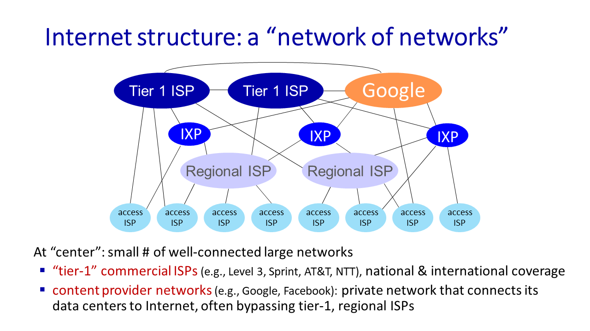

# COMPSCI 453 

## chapter1-Computer Networks and the Internet

### 1.1_What is the Internet

<u>§Introduction. What *is* the Internet? What *is* a protocol?</u>

Internet is network of networks

*Protocols* *define the* *format**,* *order* *of* *messages sent and received* *among network entities, and* *actions taken* *on message transmission, receipt* 

### 1.2_Network edge

*A closer look at Internet structure*

- *Network edge:*

  - ***hosts: clients and servers***

  - *servers often in data centers*

- *Access networks, physical media:*

  - *wired, wireless communication links*

- *Network core:* 

  - *interconnected routers*
  - *network of networks*

host sending function:

- takes application message
- breaks into smaller chunks, known as *packets*, of length *L* bits
- transmits packet into access network at *transmission rate R*
  - link transmission rate, aka link *capacity, aka link bandwidth*

$$
packet Transmission Delay=time Needed To Transmit Lbit
Packet Into Link=\frac{L_{(bits)}}{R_{(bits/sec)}}
$$

### 1.3_Network Core

<u>§Network core: packet/circuit switching, internet structure</u>

- forwarding,routing
- packet switching
- circuit switching
- structure of today's internet

#### The network core

1. mesh of interconnected routers

2. packet-switching: hosts break application-layer messages into *packets*
   1. network forwards packets from one router to the next, across links on path from source to destination

#### Two key network-core functions

*Forwarding:* 

- aka “switching”

- *local* action: move arriving packets from router’s input link to appropriate router output link

*Routing:*

- *global* action: determine source-destination paths taken by packets

- routing algorithms

#### Packet-switching（分组交换）

[分组](https://zh.wikipedia.org/wiki/網路封包)[[注 1\]](https://zh.wikipedia.org/wiki/封包交換#cite_note-1)（又称消息、或消息碎片）在[节点](https://zh.wikipedia.org/wiki/节点_(电信网络))间单独[路由](https://zh.wikipedia.org/wiki/路由)，不需要在传输前先建立通信路径。

**store-and-forward**

- packet transmission delay: takes *L*/*R* seconds to transmit (push out) *L*-bit packet into link at *R* bps
- *store and forward:* *entire* packet must arrive at router before it can be transmitted on next link

**queueing**

- *Packet queuing and loss:* if arrival rate (in bps) to link exceeds transmission rate (bps) of link for some period of time:
  - packets will queue, waiting to be transmitted on output link 
  - packets can be dropped (lost) if memory (buffer) in router fills up

Alternative to packet switching:**circuit switching**（电路交换）

通信双方需要传递的信息都是通过已经建立好的连接来进行传递的，而且这个连接也将一直被维持到双方的通信结束。

- end-end resources allocated to, reserved for “call” between source and destination
  - FDM(frequency) or TDM(time)
- can't share bandwidth 

**Packet switching versus circuit switching**

- great for “bursty” data – sometimes has data to send, but at other times not
  - resource sharing
  - simpler, no call setup

- excessive congestion possible: packet delay and loss due to buffer overflow
  - protocols needed for reliable data transfer, congestion control

*Q:* How to provide circuit-like behavior with packet-switching?

*A:*“It’s complicated.” We’ll study various techniques that try to make packet switching as “circuit-like” as possible.

报文交换与电路交换相比是将数据划分成更小的单位称为数据包。报文交换可共享多个通信会话的可用网络带宽。 复用在同一物理导体多个电信连接已经很长一段时间，然而每个通道上的复用的链接要么致力于一次通话，或者是闲置之间的通话。 在电路交换，[虚电路](https://zh.wikipedia.org/wiki/虚电路)交换，[路由](https://zh.wikipedia.org/wiki/路由)和[带宽](https://zh.wikipedia.org/wiki/带宽)预留从源到目的地。电路交换可以相对低效的，因为能力是保证建立连接，但不连续使用，而是暂时的。然而，连接是立即可用，同时成立。 报文交换是分割的消息/被分成几个较小的[数据包](https://zh.wikipedia.org/wiki/数据包)传输数据的过程。每个数据包都标有其目的和订购相关的数据包的序列号，解除需要一个专用的路径，以帮助找到包到其目的地的方式。每个数据包调度独立，每个人都可以通过不同的路径传送。在目的地，原始邮件将被以正确的顺序重组，根据数据包的数量。报文交换网络不需要建立一个电路，并允许许多双[节点](https://zh.wikipedia.org/wiki/节点)同时在同一通道进行通信。

#### Internet structure: a “network of networks”

- hosts connect to Internet via access Internet Service Providers (ISPs)
- access ISPs in turn must be interconnected
  - so that *any* two hosts *(anywhere!)* can send packets to each other

- resulting network of networks is very complex(evolution driven by economics, national policies)

  1. *Option:* *connect each access ISP to one global transit ISP?

  2. But if one global ISP is viable business, there will be competitors ….who will want to be connected
  3. Internet exchange point (IXP)
  4. and regional networks may arise to connect access nets to ISPs 
  5. and content provider networks (e.g., Google, Microsoft, Akamai) may run their own network, to bring services, content close to end users



### 1.4_Performance

<u>§Performance: loss, delay, throughput</u>

- components of network delay
- *traceroute*:looking at network delays
- packet loss
- throughput

#### packet delay

$$
d_{nodal}=d_{proc}+d_{queue}+d_{trans}+d_{drop}
$$

$$d_{proc}$$:nodal processing

- check bit errors
- determine output link
- typically < microsecs

$$d_{queue}$$:queueing delay

- time waiting at output link for transmission 
- depends on congestion level of router

$$d_{trans}$$:transmission（宽频传输） delay

- *L*: packet length (bits) 

- *R*: link *transmission rate (bps)*

- $$d_{trans} = \frac{L}{R}$$

$$d_{prop}$$:propagation delay

- *d*: length of physical link

- *s*:propagation speed ($$~2\times10^8 m/sec$$)

- $$d_{prop} = \frac{d}{s}$$


#### packet loss

- *throughput:* rate (bits/time unit) at which bits are being sent from sender to receiver
  - *instantaneous:* rate at given point in time
  
  - *average:* rate over longer period of time
  - the throughput that a source to destination path can receive is going to be limited by the capacity of the thinnest pipe.
  - bottleneck link: link on end-end path that constrains end-end throughput（限制终端吞吐量的链路）

### 1.5_Protocol layers

<u>§Layering, encapsulation, service models</u>

- architectural layering
- Internet layers
- encapsulation

#### Layered Internet protocol stack

5. *application:* supporting network applications
   - HTTP, IMAP, SMTP, DNS

4. *transport:* process-process data transfer
   - TCP, UDP

3. *network:* routing of datagrams from source to destination
   - IP, routing protocols

2. *link:* data transfer between neighboring network elements
   - Ethernet, 802.11 (WiFi), PPP

1. *physical:* bits “on the wire”

#### Services, Layering and Encapsulation


- transport-layer protocol encapsulates application-layer <u>message</u>, $$M$$, with *transport* layer-layer header $$H_t$$ to create a transport-layer <u>segment</u>.
  - $$H_t$$  used by transport layer protocol to implement its service.
- network-layer protocol encapsulates transport-layer segment $$[H_t | M] $$ with network layer-layer header $$H_n$$ to create a network-layer datagram.
  - $$H_n$$  used by network layer protocol to implement its service.

- link-layer protocol encapsulates network <u>datagram</u> $$[H_n| [H_t |M]$$, with link-layer header $$H_l$$  to create a link-layer <u>frame</u>.


### 1.6_Network Security

<u>§Networks under attack</u>

- What can bad actors do?
- what defenses designed, deployed?

#### Bad guys

- packet interception

  - *packet “sniffing”:* 

    - broadcast media (shared Ethernet, wireless)

    - promiscuous network interface reads/records all packets (e.g., including passwords!) passing by

- fake identity

  - *IP spoofing:* injection of packet with false source address

- denial of service

  - *Denial of Service (DoS):* attackers make resources (server, bandwidth) unavailable to legitimate traffic by overwhelming resource with bogus traffic
    1. select target
    2. break into hosts around the network (see botnet)
    3. send packets to target from compromised hosts

#### Lines of defense

- authentication: proving you are who you say you are
  - cellular networks provides hardware identity via SIM card; no such hardware assist in traditional Internet
- confidentiality: via encryption

- integrity checks: digital signatures prevent/detect tampering

- access restrictions: password-protected VPNs

- firewalls: specialized “middleboxes” in access and core networks:
  - off-by-default: filter incoming packets to restrict senders, receivers, applications 
  - detecting/reacting to DOS attacks

### Self-Assessment Quiz 1

we are sending a 30 Mbit MP3 file from a source host to a destination host. All links in the path between source and destination have a transmission rate of 10 Mbps. Assume that the propagation speed is 2 * 108 meters/sec, and the distance between source and destination is 10,000 km. Now suppose that the MP3 file is broken into 3 packets, each of 10 Mbits. Ignore headers that may be added to these packets. Also ignore router processing delays. Assuming store and forward packet switching at the router, the total delay is **<u>4.05 secs</u>**

## Chapter 2-Application Layer

### 2.1_Principles of network applications

- application: distributed interacting processes,exchanging messages

- client-server, P2P paradigms
- sockets, addressing
- transport layer service--possible, available services
- security and sockets

<u>Our goals:</u> 

- conceptual *and* implementation aspects of application-layer protocols

  - transport-layer service models

  - client-server paradigm

  - peer-to-peer paradigm

- learn about protocols by examining popular application-layer protocols and infrastructure

  - HTTP
  - SMTP, IMAP
  - DNS
  - video streaming systems, CDNs

- programming network applications

  - socket API

#### creating a network app

##### client-server

server:

- always-on host

- permanent IP address

- often in data centers, for scaling

clients:

- contact, communicate with server

- may be intermittently connected

- may have dynamic IP addresses

- do *not* communicate directly with each other

- examples: HTTP, IMAP, FTP

##### Peer-peer architecture

- *no* always-on server

- arbitrary end systems directly communicate

- peers request service from other peers, provide service in return to other peers
  - *self scalability* – new peers bring new service capacity, as well as new service demands

- peers are intermittently connected and change IP addresses
  - complex management

- example: P2P file sharing [BitTorrent]

#### Processes communicating

*process:* program running within a host

- within same host, two processes communicate using inter-process communication (defined by OS)

- processes in different hosts communicate by exchanging messages
- clients,servers
  - *client process:* process that initiates communication
  - *server process:* process that waits to be contacted
- note: applications with P2P architectures have client processes & server processes

#### Sockets

- process sends/receives messages to/from its socket

- socket analogous to door

  - sending process shoves message out door

  - sending process relies on transport infrastructure on other side of door to deliver message to socket at receiving process

  - two sockets involved: one on each side

#### Addressing processes（寻址）

- to receive messages, process must have *identifier*

- host device has unique 32-bit IP address

*Q:* does IP address of host on which process runs suffice for identifying the process?

*A:* no, *many* processes can be running on same host

- *identifier* includes both IP address and port numbers associated with process on host.

- example port numbers:

  - HTTP server: 80

  - mail server: 25

- to send HTTP message to gaia.cs.umass.edu web server:

  - IP address: 128.119.245.12

  - port number: 80

#### An application-layer protocol defines:

- types of messages exchanged, 
  - e.g., request, response 

- message syntax:
  - what fields in messages & how fields are delineated

- message semantics 
  - meaning of information in fields

- rules for when and how processes send & respond to messages

- open protocols:

  - defined in RFCs, everyone has access to protocol definition

  - allows for interoperability

  - e.g., HTTP, SMTP

- proprietary protocols:

  - e.g., Skype, Zoom

#### Internet transport protocols services

data integrity | throughput | timing |security

##### TCP service:

- *reliable transport* between sending and receiving process

- *flow control:* sender won’t overwhelm receiver 

- *congestion(拥堵) control:* throttle sender when network overloaded

- *connection-oriented:* setup required between client and server processes

- *does not provide:* timing, minimum throughput guarantee, security

##### UDP service:

- *unreliable data transfer* between sending and receiving process

- *does not provide:* reliability, flow control, congestion control, timing, throughput guarantee, security, or connection setup.

#### Securing TCP

##### Vanilla TCP & UDP sockets:

- no encryption（加密）

- cleartext passwords sent into socket traverse Internet in cleartext (!)

##### Transport Layer Security (TLS)

- provides encrypted TCP connections

- data integrity

- end-point authentication

### 2.2_Web, HTTP

- Web, HTTP overview
- HTTP connections
  - TCP, "stateless"
  - persisitent, non-persistent
- HTTP messages
  - requests, responses
- HTTP cookies
- Web caches
- Conditional HTTP GET
- HTTP/2, HTTP/3

#### HTTP(hypertext transfer protocol) overview

##### Web's application layer protocol

- client/server model:
  - client: brower that requests, receives, (using HTTP protocol) and “displays” Web objects 
  - *server:* Web server sends (using HTTP protocol) objects in response to requests


##### *HTTP uses TCP:*

1. client initiates TCP connection (creates socket) to server, port 80
2. server accepts TCP connection from client
3. HTTP messages (application-layer protocol messages) exchanged between browser (HTTP client) and Web server (HTTP server)
4. TCP connection closed

##### *HTTP is “stateless”*

- server maintains *no* information about past client requests
- no notion of multi-step exchanges of HTTP messages to complete a Web “transaction”
  - no need for client/server to track “state” of multi-step exchange
  - all HTTP requests are independent of each other
  - no need for client/server to “recover” from a partially-completed-but-never-completely-completed transaction

- aside: protocols that maintain “state” are complex!
  - past history (state) must be maintained
  - if server/client crashes, their views of “state” may be inconsistent, must be reconciled


在電腦的系統裡，所謂**狀態(State)**指得是某個東西在某個時間點下的狀況，而有狀態(Stateful)的意思則是，**輸出的值會依賴不同時間點下的狀態而改變**。

不同於有狀態，無狀態(Stateless)可以說是現代網際網路的基礎，幾乎在每個面向都應用了無狀態的服務。例如你在讀網路新聞時使用了`HTTP`，在滑`Facebook`時使用了`Facebook REST API`來調出版面上的貼文。

每個伺服器的回覆都不依賴任何存於伺服器的狀態，而是以快取的形式存在客戶端。我們不需要等待伺服器來確認我們的操作是否被正確地處理了。

#### HTTP connections: two types

##### *Non-persistent HTTP(HTTP1.0)*

1. TCP connection opened
2. at most one object sent over TCP connection
3. TCP connection closed

downloading multiple objects required multiple connections


- requires 2 RTTs per object

- OS overhead for *each* TCP connection

- browsers often open multiple parallel TCP connections to fetch referenced objects in parallel

##### *Persistent HTTP(HTTP1.1)*

- TCP connection opened to a server
- multiple objects can be sent over *single* TCP connection between client, and that server
- TCP connection closed

- server leaves connection open after sending response
- subsequent HTTP messages between same client/server sent over open connection
- client sends requests as soon as it encounters a referenced object
- as little as one RTT for all the referenced objects (cutting response time in half)


cr: carriage return character 回车

lf: line-feed character  换行

 for yourself.png)

#### Maintaining user/server state: cookies

HTTP can be made stateful using cookies and sessions, which are two techniques that allow storing and transferring some information about the communication between clients and servers.

*four components:*

1) cookie header line of HTTP *response* message
2) cookie header line in next HTTP *request* message
3) cookie file kept on user’s host, managed by user’s browser
4) back-end database at Web site

#### Web caches (aka proxy servers)

*Goal:* satisfy client requests without involving origin server

- user configures browser to point to a (local) *Web cache*

- browser sends all HTTP requests to cache

  - *if* object in cache: cache returns object to client

  - *else* cache requests object from origin server, caches received object, then returns object to client

- Web cache acts as both client and server

  - server for original requesting client
  - client to origin server

- server tells cache about object’s allowable caching in response header:

  ```http
  Cache-Control: max-age=<seconds>
  Cache-Control: no-cache
  ```

##### *Why* Web caching?

- reduce response time for client request 
  - cache is closer to client

- reduce traffic on an institution’s access link

- Internet is dense with caches 
  - enables “poor” content providers to more effectively deliver content

#### Browser caching: Conditional GET

*Goal:* don’t send object if browser has up-to-date cached version

- no object transmission delay (or use of network resources)

- *client:* specify date of browser-cached copy in HTTP request

  ```http
  <!--request--!>
  If-modified-since: <date>
  ```

- *server:* response contains no object if browser-cached copy is up-to-date: 

  ```http
  <!--response--!>
  HTTP/1.0 304 Not Modified
  <!--object not modified before<date>-->
  HTTP/1.0 200 OK
  <data>
  <!--object modified after <date>-->
  ```

#### HTTP1.1

introduced multiple, pipelined GETs over single TCP connection

- server responds *in-order* (FCFS: first-come-first-served scheduling) to GET requests

- with FCFS, small object may have to wait for transmission (head-of-line (HOL) blocking) behind large object(s)

- loss recovery (retransmitting lost TCP segments) stalls object transmission

#### HTTP/2

*Key goal:* decreased delay in multi-object HTTP requests

increased flexibility at *server* in sending objects to client:

- methods, status codes, most header fields unchanged from HTTP 1.1

- transmission order of requested objects based on client-specified object priority (not necessarily FCFS)

- *push* unrequested objects to client

- divide objects into frames, schedule frames to **mitigate HOL blocking**

四个objects，A最大，BCD都很小，按ABCD的顺序到了，将他们等大小分成A-1|A-2|A-3|A-4|A-5|B-1|B-2|C-1|C-2|D-1，由A-1|B-1|C-1|D-1|A-2......的顺序进行deliver,此时只有A会有delay.

##### HTTP/2 to HTTP/3

HTTP/2 over single TCP connection means:

- recovery from packet loss still stalls all object transmissions
  - as in HTTP 1.1, browsers have incentive to open multiple parallel TCP connections to reduce stalling, increase overall throughput

- no security over vanilla TCP connection

- HTTP/3: adds security, per object error- and congestion-control (more pipelining) over UDP
  - more on HTTP/3 in transport layer

### 2.3_E-mail, SMTP, IMAP

- infrastructure: user agents, servers, mailboxes
- SMTP: simple mail transfer protocol

#### E-mail

Three major components: 

- user agents 

- mail servers 

- simple mail transfer protocol: SMTP

User Agent

- a.k.a. “mail reader”

- composing, editing, reading mail messages

- e.g., Outlook, iPhone mail client

- outgoing, incoming messages stored on server

##### mail servers

- *mailbox* contains incoming messages for user

- *message queue* of outgoing (to be sent) mail messages

- SMTP protocol between mail servers to send email messages

  - client: sending mail server

  - “server”: receiving mail server

#### SMTP RFC 5321

- uses TCP to reliably transfer email message from client (mail server initiating connection) to server, port 25
  - direct transfer: sending server (acting like client) to receiving server

- three phases of transfer

  - SMTP handshaking (greeting)

  - SMTP transfer of messages

  - SMTP closure

- command/response interaction (like HTTP)

  - commands: ASCII text

  - response: status code and phrase

SMTP: observations

*comparison with HTTP:*

- HTTP: client pull

- SMTP: client push

- both have ASCII command/response interaction, status codes

- HTTP: each object encapsulated in its own response message

- SMTP: multiple objects sent in multipart message
- SMTP uses persistent connections
- SMTP requires message (header & body) to be in 7-bit ASCII
- SMTP server uses CRLF.CRLF to determine end of message

#### Retrieving email: mail access protocols

- SMTP: delivery/storage of e-mail messages to receiver’s server

- mail access protocol: retrieval from server
  - IMAP: Internet Mail Access Protocol [RFC 3501]: messages stored on server, IMAP provides retrieval, deletion, folders of stored messages on server

- HTTP: gmail, Hotmail, Yahoo!Mail, etc. provides web-based interface on top of STMP (to send), IMAP (or POP) to retrieve e-mail messages

### 2.4_The Domain Name System DNS

core Internet function, implemented as application-layer protocol

- DNS structure, function
- resolving DNS queries
- DNS record format
- DNS protocol messages

#### DNS: services, structure

- hostname-to-IP-address translation

- host aliasing
  - canonical, alias names

- mail server aliasing

- load distribution
  - replicated Web servers: many IP addresses correspond to one name

Q: Why not centralize DNS?

#### DNS: a distributed, hierarchical database

##### root name servers

- official, contact-of-last-resort by name servers that can not resolve name

- *incredibly important* Internet function
  - Internet couldn’t function without it!
  - DNSSEC – provides security (authentication, message integrity)

- ICANN (Internet Corporation for Assigned Names and Numbers) manages root DNS domain

##### Top-Level Domain (TLD) servers

- responsible for .com, .org, .net, .edu, .aero, .jobs, .museums, and all top-level country domains, e.g.: .cn, .uk, .fr, .ca, .jp

- Network Solutions: authoritative registry for .com, .net TLD

- Educause: .edu TLD

##### authoritative DNS servers

- organization’s own DNS server(s), providing authoritative hostname to IP mappings for organization’s named hosts 

- can be maintained by organization or service provider

##### Local DNS name servers

- when host makes DNS query, it is sent to its *local* DNS server

  - Local DNS server returns reply, answering:

    - from its local cache of recent name-to-address translation pairs (possibly out of date!)

    - forwarding request into DNS hierarchy for resolution

- each ISP has local DNS name server; to find yours: 

  - MacOS: % scutil --dns

  - Windows: >ipconfig /all

- local DNS server doesn’t strictly belong to hierarchy

#### DNS name resolution

##### iterated query

- contacted server replies with name of server to contact

- “I don’t know this name, but ask this server

##### Recursive query

- puts burden of name resolution on contacted name server

- heavy load at upper levels of hierarchy?

#### Caching DNS Information

- once (any) name server learns mapping, it *caches* mapping, and i*mmediately* returns a cached mapping in response to a query

  - caching improves response time

  - cache entries timeout (disappear) after some time (TTL)

  - TLD servers typically cached in local name servers

- cached entries may be *out-of-date*

  - if named host changes IP address, may not be known Internet-wide until all TTLs expire!

  - *best-effort name-to-address translation!*


#### DNS security

DDoS attacks

- bombard root servers with traffic

  - not successful to date

  - traffic filtering

  - local DNS servers cache IPs of TLD servers, allowing root server bypass

- bombard TLD servers
  - potentially more dangerous

#### what's more

- DNS使用的端口号是53，同时使用TCP和UDP协议
- you can send multiple DNS questions and get multiple PR answers in one message 

### 2.5_Peer-to-peer (P2P) architecture

- *no* always-on server

- arbitrary end systems directly communicate

- peers request service from other peers, provide service in return to other peers
  - *self scalability* – new peers bring new service capacity, and new service demands

- peers are intermittently connected and change IP addresses
  - complex management

- examples: P2P file sharing (BitTorrent), streaming (KanKan), VoIP (Skype)

#### BitTorrent

- peer joining torrent: 

  - has no chunks, but will accumulate them over time from other peers

  - registers with tracker to get list of peers, connects to subset of peers (“neighbors

- while downloading, peer uploads chunks to other peers

- peer may change peers with whom it exchanges chunks

- *churn:* peers may come and go

- once peer has entire file, it may (selfishly) leave or (altruistically) remain in torrent

### 2.6_video streaming and content distribution networks

- video characteristics
- streaming stored video
  - buffering
  - playout
- DASH: dynamic client-driven streaming
- CDNs,example


### streaming multimedia: DASH(*D*ynamic, *A*daptive *S*treaming over *H*TTP)

#### server:

- divides video file into multiple chunks

- each chunk encoded at multiple different rates

- different rate encodings stored in different files

- files replicated in various CDN nodes

- *manifest file:* provides URLs for different chunks

#### client:

- periodically estimates server-to-client bandwidth

- consulting manifest, requests one chunk at a time 

- chooses maximum coding rate sustainable given current bandwidth

- can choose different coding rates at different points in time (depending on available bandwidth at time), and from different servers

#### *“intelligence”* at client: client determines

- *when* to request chunk (so that buffer starvation, or overflow does not occur)

- *what encoding rate* to request (higher quality when more bandwidth available)
- *where* to request chunk (can request from URL server that is “close” to client or has high available bandwidth) 
- Streaming video = encoding + DASH + playout buffering

### Content distribution networks (CDNs)

store/serve multiple copies of videos at multiple geographically distributed sites *(CDN)*

- *enter deep:* push CDN servers deep into many access networks 

  - close to users

  - Akamai: 240,000 servers deployed in > 120 countries (2015)

- *bring home:* smaller number (10’s) of larger clusters in POPs near access nets

  - used by Limelight

- *OTT(over the top) challenges:* coping with a congested Internet from the “edge”

  - what content to place in which CDN node?

  - from which CDN node to retrieve content? At which rate?


### 2.7_Socket Programming

- socket abstraction
- UDP socket
  - client
  - server

- TCP sockets
  - client
  - server
    - timeout

  - WebServer
    - threading

  - HTTP client


------------------

[Jim Kurose Homepage (umass.edu)](https://gaia.cs.umass.edu/kurose_ross/index.php)

Self-Assessment Quiz : small quiz for each chapter

- [Self-Assessment Multiple Choice Quiz](https://media.pearsoncmg.com/ph/esm/ecs_kurose_compnetwork_8/cw/content/self-assessment-mc/self-assessment-mc.php) 

- [Self-Assessment True/False Quiz](https://media.pearsoncmg.com/ph/esm/ecs_kurose_compnetwork_8/cw/content/self-assessment-tf/self-assessment-tf.php)

[Interactive Animation](https://media.pearsoncmg.com/ph/esm/ecs_kurose_compnetwork_8/cw/#interactiveanimations) :  vivid animation for some obscure concepts 

[Other materials](https://media.pearsoncmg.com/ph/esm/ecs_kurose_compnetwork_8/cw/)

[moranzcw/Computer-Networking-A-Top-Down-Approach-NOTES: 《计算机网络－自顶向下方法(原书第6版)》编程作业，Wireshark实验文档的翻译和解答。 (github.com)](https://github.com/moranzcw/Computer-Networking-A-Top-Down-Approach-NOTES?tab=readme-ov-file)

