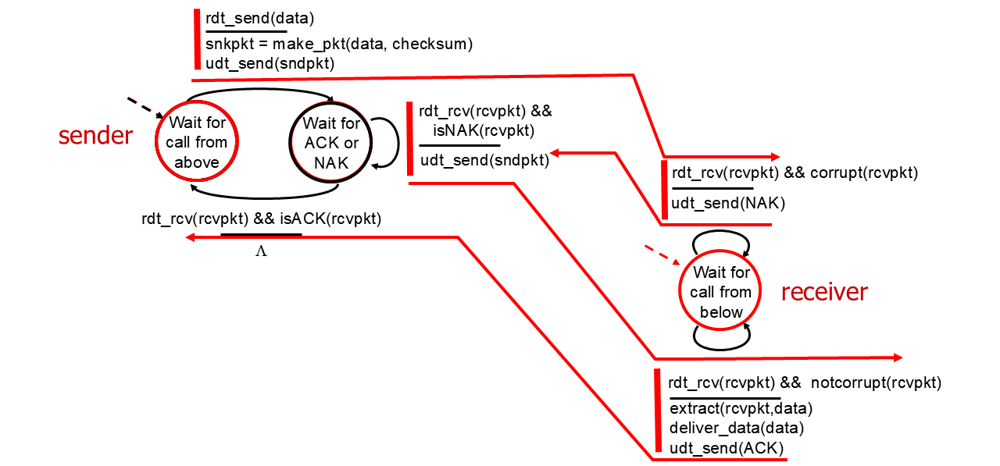
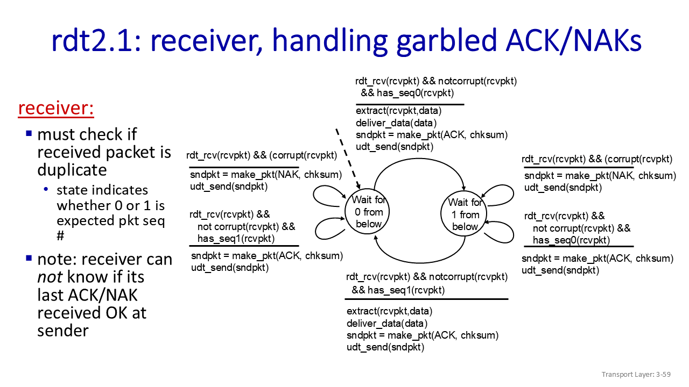

# COMPSCI 453 

## chapter1-Computer Networks and the Internet

### 1.1_What is the Internet

<u>§Introduction. What *is* the Internet? What *is* a protocol?</u>

Internet is network of networks

*Protocols* *define the* *format**,* *order* *of* *messages sent and received* *among network entities, and* *actions taken* *on message transmission, receipt* 

### 1.2_Network edge

*A closer look at Internet structure*

- *Network edge:*

  - ***hosts: clients and servers***

  - *servers often in data centers*

- *Access networks, physical media:*

  - *wired, wireless communication links*

- *Network core:* 

  - *interconnected routers*
  - *network of networks*

host sending function:

- takes application message
- breaks into smaller chunks, known as *packets*, of length *L* bits
- transmits packet into access network at *transmission rate R*
  - link transmission rate, aka link *capacity, aka link bandwidth*

$$
packet Transmission Delay=time Needed To Transmit Lbit
Packet Into Link=\frac{L_{(bits)}}{R_{(bits/sec)}}
$$

### 1.3_Network Core

<u>§Network core: packet/circuit switching, internet structure</u>

- forwarding,routing
- packet switching
- circuit switching
- structure of today's internet

#### The network core

1. mesh of interconnected routers

2. packet-switching: hosts break application-layer messages into *packets*
   1. network forwards packets from one router to the next, across links on path from source to destination

#### Two key network-core functions

*Forwarding:* 

- aka “switching”

- *local* action: move arriving packets from router’s input link to appropriate router output link

*Routing:*

- *global* action: determine source-destination paths taken by packets

- routing algorithms

#### Packet-switching（分组交换）

[分组](https://zh.wikipedia.org/wiki/網路封包)[[注 1\]](https://zh.wikipedia.org/wiki/封包交換#cite_note-1)（又称消息、或消息碎片）在[节点](https://zh.wikipedia.org/wiki/节点_(电信网络))间单独[路由](https://zh.wikipedia.org/wiki/路由)，不需要在传输前先建立通信路径。

**store-and-forward**

- packet transmission delay: takes *L*/*R* seconds to transmit (push out) *L*-bit packet into link at *R* bps
- *store and forward:* *entire* packet must arrive at router before it can be transmitted on next link

**queueing**

- *Packet queuing and loss:* if arrival rate (in bps) to link exceeds transmission rate (bps) of link for some period of time:
  - packets will queue, waiting to be transmitted on output link 
  - packets can be dropped (lost) if memory (buffer) in router fills up

Alternative to packet switching:**circuit switching**（电路交换）

通信双方需要传递的信息都是通过已经建立好的连接来进行传递的，而且这个连接也将一直被维持到双方的通信结束。

- end-end resources allocated to, reserved for “call” between source and destination
  - FDM(frequency) or TDM(time)
- can't share bandwidth 

**Packet switching versus circuit switching**

- great for “bursty” data – sometimes has data to send, but at other times not
  - resource sharing
  - simpler, no call setup

- excessive congestion possible: packet delay and loss due to buffer overflow
  - protocols needed for reliable data transfer, congestion control

*Q:* How to provide circuit-like behavior with packet-switching?

*A:*“It’s complicated.” We’ll study various techniques that try to make packet switching as “circuit-like” as possible.

报文交换与电路交换相比是将数据划分成更小的单位称为数据包。报文交换可共享多个通信会话的可用网络带宽。 复用在同一物理导体多个电信连接已经很长一段时间，然而每个通道上的复用的链接要么致力于一次通话，或者是闲置之间的通话。 在电路交换，[虚电路](https://zh.wikipedia.org/wiki/虚电路)交换，[路由](https://zh.wikipedia.org/wiki/路由)和[带宽](https://zh.wikipedia.org/wiki/带宽)预留从源到目的地。电路交换可以相对低效的，因为能力是保证建立连接，但不连续使用，而是暂时的。然而，连接是立即可用，同时成立。 报文交换是分割的消息/被分成几个较小的[数据包](https://zh.wikipedia.org/wiki/数据包)传输数据的过程。每个数据包都标有其目的和订购相关的数据包的序列号，解除需要一个专用的路径，以帮助找到包到其目的地的方式。每个数据包调度独立，每个人都可以通过不同的路径传送。在目的地，原始邮件将被以正确的顺序重组，根据数据包的数量。报文交换网络不需要建立一个电路，并允许许多双[节点](https://zh.wikipedia.org/wiki/节点)同时在同一通道进行通信。

#### Internet structure: a “network of networks”

- hosts connect to Internet via access Internet Service Providers (ISPs)
- access ISPs in turn must be interconnected
  - so that *any* two hosts *(anywhere!)* can send packets to each other

- resulting network of networks is very complex(evolution driven by economics, national policies)

  1. *Option:* *connect each access ISP to one global transit ISP?

  2. But if one global ISP is viable business, there will be competitors ….who will want to be connected
  3. Internet exchange point (IXP)
  4. and regional networks may arise to connect access nets to ISPs 
  5. and content provider networks (e.g., Google, Microsoft, Akamai) may run their own network, to bring services, content close to end users


### 1.4_Performance

<u>§Performance: loss, delay, throughput</u>

- components of network delay
- *traceroute*:looking at network delays
- packet loss
- throughput

#### packet delay

$$
d_{nodal}=d_{proc}+d_{queue}+d_{trans}+d_{drop}
$$

$$d_{proc}$$:nodal processing

- check bit errors
- determine output link
- typically < microsecs

$$d_{queue}$$:queueing delay

- time waiting at output link for transmission 
- depends on congestion level of router

$$d_{trans}$$:transmission（宽频传输） delay

- *L*: packet length (bits) 

- *R*: link *transmission rate (bps)*

- $$d_{trans} = \frac{L}{R}$$

$$d_{prop}$$:propagation delay

- *d*: length of physical link

- *s*:propagation speed ($$~2\times10^8 m/sec$$)

- $$d_{prop} = \frac{d}{s}$$


#### packet loss

- *throughput:* rate (bits/time unit) at which bits are being sent from sender to receiver
  - *instantaneous:* rate at given point in time
  
  - *average:* rate over longer period of time
  - the throughput that a source to destination path can receive is going to be limited by the capacity of the thinnest pipe.
  - bottleneck link: link on end-end path that constrains end-end throughput（限制终端吞吐量的链路）

### 1.5_Protocol layers

<u>§Layering, encapsulation, service models</u>

- architectural layering
- Internet layers
- encapsulation

#### Layered Internet protocol stack

5. *application:* supporting network applications
   - HTTP, IMAP, SMTP, DNS

4. *transport:* process-process data transfer
   - TCP, UDP

3. *network:* routing of datagrams from source to destination
   - IP, routing protocols

2. *link:* data transfer between neighboring network elements
   - Ethernet, 802.11 (WiFi), PPP

1. *physical:* bits “on the wire”

#### Services, Layering and Encapsulation


- transport-layer protocol encapsulates application-layer <u>message</u>, $$M$$, with *transport* layer-layer header $$H_t$$ to create a transport-layer <u>segment</u>.
  - $$H_t$$  used by transport layer protocol to implement its service.
- network-layer protocol encapsulates transport-layer segment $$[H_t | M] $$ with network layer-layer header $$H_n$$ to create a network-layer datagram.
  - $$H_n$$  used by network layer protocol to implement its service.

- link-layer protocol encapsulates network <u>datagram</u> $$[H_n| [H_t |M]$$, with link-layer header $$H_l$$  to create a link-layer <u>frame</u>.


### 1.6_Network Security

<u>§Networks under attack</u>

- What can bad actors do?
- what defenses designed, deployed?

#### Bad guys

- packet interception

  - *packet “sniffing”:* 

    - broadcast media (shared Ethernet, wireless)

    - promiscuous network interface reads/records all packets (e.g., including passwords!) passing by

- fake identity

  - *IP spoofing:* injection of packet with false source address

- denial of service

  - *Denial of Service (DoS):* attackers make resources (server, bandwidth) unavailable to legitimate traffic by overwhelming resource with bogus traffic
    1. select target
    2. break into hosts around the network (see botnet)
    3. send packets to target from compromised hosts

#### Lines of defense

- authentication: proving you are who you say you are
  - cellular networks provides hardware identity via SIM card; no such hardware assist in traditional Internet
- confidentiality: via encryption

- integrity checks: digital signatures prevent/detect tampering

- access restrictions: password-protected VPNs

- firewalls: specialized “middleboxes” in access and core networks:
  - off-by-default: filter incoming packets to restrict senders, receivers, applications 
  - detecting/reacting to DOS attacks

### Self-Assessment Quiz 1

we are sending a 30 Mbit MP3 file from a source host to a destination host. All links in the path between source and destination have a transmission rate of 10 Mbps. Assume that the propagation speed is 2 * 108 meters/sec, and the distance between source and destination is 10,000 km. Now suppose that the MP3 file is broken into 3 packets, each of 10 Mbits. Ignore headers that may be added to these packets. Also ignore router processing delays. Assuming store and forward packet switching at the router, the total delay is **<u>4.05 secs</u>**

## Chapter 2-Application Layer

### 2.1_Principles of network applications

- application: distributed interacting processes,exchanging messages

- client-server, P2P paradigms
- sockets, addressing
- transport layer service--possible, available services
- security and sockets

<u>Our goals:</u> 

- conceptual *and* implementation aspects of application-layer protocols

  - transport-layer service models

  - client-server paradigm

  - peer-to-peer paradigm

- learn about protocols by examining popular application-layer protocols and infrastructure

  - HTTP
  - SMTP, IMAP
  - DNS
  - video streaming systems, CDNs

- programming network applications

  - socket API

#### creating a network app

##### client-server

server:

- always-on host

- permanent IP address

- often in data centers, for scaling

clients:

- contact, communicate with server

- may be intermittently connected

- may have dynamic IP addresses

- do *not* communicate directly with each other

- examples: HTTP, IMAP, FTP

##### Peer-peer architecture

- *no* always-on server

- arbitrary end systems directly communicate

- peers request service from other peers, provide service in return to other peers
  - *self scalability* – new peers bring new service capacity, as well as new service demands

- peers are intermittently connected and change IP addresses
  - complex management

- example: P2P file sharing [BitTorrent]

#### Processes communicating

*process:* program running within a host

- within same host, two processes communicate using inter-process communication (defined by OS)

- processes in different hosts communicate by exchanging messages
- clients,servers
  - *client process:* process that initiates communication
  - *server process:* process that waits to be contacted
- note: applications with P2P architectures have client processes & server processes

#### Sockets

- process sends/receives messages to/from its socket

- socket analogous to door

  - sending process shoves message out door

  - sending process relies on transport infrastructure on other side of door to deliver message to socket at receiving process

  - two sockets involved: one on each side

#### Addressing processes（寻址）

- to receive messages, process must have *identifier*

- host device has unique 32-bit IP address

*Q:* does IP address of host on which process runs suffice for identifying the process?

*A:* no, *many* processes can be running on same host

- *identifier* includes both IP address and port numbers associated with process on host.

- example port numbers:

  - HTTP server: 80

  - mail server: 25

- to send HTTP message to gaia.cs.umass.edu web server:

  - IP address: 128.119.245.12

  - port number: 80

#### An application-layer protocol defines:

- types of messages exchanged, 
  - e.g., request, response 

- message syntax:
  - what fields in messages & how fields are delineated

- message semantics 
  - meaning of information in fields

- rules for when and how processes send & respond to messages

- open protocols:

  - defined in RFCs, everyone has access to protocol definition

  - allows for interoperability

  - e.g., HTTP, SMTP

- proprietary protocols:

  - e.g., Skype, Zoom

#### Internet transport protocols services

data integrity | throughput | timing |security

##### TCP service:

- *reliable transport* between sending and receiving process

- *flow control:* sender won’t overwhelm receiver 

- *congestion(拥堵) control:* throttle sender when network overloaded

- *connection-oriented:* setup required between client and server processes

- *does not provide:* timing, minimum throughput guarantee, security

##### UDP service:

- *unreliable data transfer* between sending and receiving process

- *does not provide:* reliability, flow control, congestion control, timing, throughput guarantee, security, or connection setup.

#### Securing TCP

##### Vanilla TCP & UDP sockets:

- no encryption（加密）

- cleartext passwords sent into socket traverse Internet in cleartext (!)

##### Transport Layer Security (TLS)

- provides encrypted TCP connections

- data integrity

- end-point authentication

### 2.2_Web, HTTP

- Web, HTTP overview
- HTTP connections
  - TCP, "stateless"
  - persisitent, non-persistent
- HTTP messages
  - requests, responses
- HTTP cookies
- Web caches
- Conditional HTTP GET
- HTTP/2, HTTP/3

#### HTTP(hypertext transfer protocol) overview

##### Web's application layer protocol

- client/server model:
  - client: brower that requests, receives, (using HTTP protocol) and “displays” Web objects 
  - *server:* Web server sends (using HTTP protocol) objects in response to requests


##### *HTTP uses TCP:*

1. client initiates TCP connection (creates socket) to server, port 80
2. server accepts TCP connection from client
3. HTTP messages (application-layer protocol messages) exchanged between browser (HTTP client) and Web server (HTTP server)
4. TCP connection closed

##### *HTTP is “stateless”*

- server maintains *no* information about past client requests
- no notion of multi-step exchanges of HTTP messages to complete a Web “transaction”
  - no need for client/server to track “state” of multi-step exchange
  - all HTTP requests are independent of each other
  - no need for client/server to “recover” from a partially-completed-but-never-completely-completed transaction

- aside: protocols that maintain “state” are complex!
  - past history (state) must be maintained
  - if server/client crashes, their views of “state” may be inconsistent, must be reconciled


在電腦的系統裡，所謂**狀態(State)**指得是某個東西在某個時間點下的狀況，而有狀態(Stateful)的意思則是，**輸出的值會依賴不同時間點下的狀態而改變**。

不同於有狀態，無狀態(Stateless)可以說是現代網際網路的基礎，幾乎在每個面向都應用了無狀態的服務。例如你在讀網路新聞時使用了`HTTP`，在滑`Facebook`時使用了`Facebook REST API`來調出版面上的貼文。

每個伺服器的回覆都不依賴任何存於伺服器的狀態，而是以快取的形式存在客戶端。我們不需要等待伺服器來確認我們的操作是否被正確地處理了。

#### HTTP connections: two types

##### *Non-persistent HTTP(HTTP1.0)*

1. TCP connection opened
2. at most one object sent over TCP connection
3. TCP connection closed

downloading multiple objects required multiple connections


- requires 2 RTTs per object

- OS overhead for *each* TCP connection

- browsers often open multiple parallel TCP connections to fetch referenced objects in parallel

##### *Persistent HTTP(HTTP1.1)*

- TCP connection opened to a server
- multiple objects can be sent over *single* TCP connection between client, and that server
- TCP connection closed

- server leaves connection open after sending response
- subsequent HTTP messages between same client/server sent over open connection
- client sends requests as soon as it encounters a referenced object
- as little as one RTT for all the referenced objects (cutting response time in half)


cr: carriage return character 回车

lf: line-feed character  换行

 for yourself.png)

#### Maintaining user/server state: cookies

HTTP can be made stateful using cookies and sessions, which are two techniques that allow storing and transferring some information about the communication between clients and servers.

*four components:*

1) cookie header line of HTTP *response* message
2) cookie header line in next HTTP *request* message
3) cookie file kept on user’s host, managed by user’s browser
4) back-end database at Web site

#### Web caches (aka proxy servers)

*Goal:* satisfy client requests without involving origin server

- user configures browser to point to a (local) *Web cache*

- browser sends all HTTP requests to cache

  - *if* object in cache: cache returns object to client

  - *else* cache requests object from origin server, caches received object, then returns object to client

- Web cache acts as both client and server

  - server for original requesting client
  - client to origin server

- server tells cache about object’s allowable caching in response header:

  ```http
  Cache-Control: max-age=<seconds>
  Cache-Control: no-cache
  ```

##### *Why* Web caching?

- reduce response time for client request 
  - cache is closer to client

- reduce traffic on an institution’s access link

- Internet is dense with caches 
  - enables “poor” content providers to more effectively deliver content

#### Browser caching: Conditional GET

*Goal:* don’t send object if browser has up-to-date cached version

- no object transmission delay (or use of network resources)

- *client:* specify date of browser-cached copy in HTTP request

  ```http
  <!--request--!>
  If-modified-since: <date>
  ```

- *server:* response contains no object if browser-cached copy is up-to-date: 

  ```http
  <!--response--!>
  HTTP/1.0 304 Not Modified
  <!--object not modified before<date>-->
  HTTP/1.0 200 OK
  <data>
  <!--object modified after <date>-->
  ```

#### HTTP1.1

introduced multiple, pipelined GETs over single TCP connection

- server responds *in-order* (FCFS: first-come-first-served scheduling) to GET requests

- with FCFS, small object may have to wait for transmission (head-of-line (HOL) blocking) behind large object(s)

- loss recovery (retransmitting lost TCP segments) stalls object transmission

#### HTTP/2

*Key goal:* decreased delay in multi-object HTTP requests

increased flexibility at *server* in sending objects to client:

- methods, status codes, most header fields unchanged from HTTP 1.1

- transmission order of requested objects based on client-specified object priority (not necessarily FCFS)

- *push* unrequested objects to client

- divide objects into frames, schedule frames to **mitigate HOL blocking**

四个objects，A最大，BCD都很小，按ABCD的顺序到了，将他们等大小分成A-1|A-2|A-3|A-4|A-5|B-1|B-2|C-1|C-2|D-1，由A-1|B-1|C-1|D-1|A-2......的顺序进行deliver,此时只有A会有delay.

##### HTTP/2 to HTTP/3

HTTP/2 over single TCP connection means:

- recovery from packet loss still stalls all object transmissions
  - as in HTTP 1.1, browsers have incentive to open multiple parallel TCP connections to reduce stalling, increase overall throughput

- no security over vanilla TCP connection

- HTTP/3: adds security, per object error- and congestion-control (more pipelining) over UDP
  - more on HTTP/3 in transport layer

### 2.3_E-mail, SMTP, IMAP

- infrastructure: user agents, servers, mailboxes
- SMTP: simple mail transfer protocol

#### E-mail

Three major components: 

- user agents 

- mail servers 

- simple mail transfer protocol: SMTP

User Agent

- a.k.a. “mail reader”

- composing, editing, reading mail messages

- e.g., Outlook, iPhone mail client

- outgoing, incoming messages stored on server

##### mail servers

- *mailbox* contains incoming messages for user

- *message queue* of outgoing (to be sent) mail messages

- SMTP protocol between mail servers to send email messages

  - client: sending mail server

  - “server”: receiving mail server

#### SMTP RFC 5321

- uses TCP to reliably transfer email message from client (mail server initiating connection) to server, port 25
  - direct transfer: sending server (acting like client) to receiving server

- three phases of transfer

  - SMTP handshaking (greeting)

  - SMTP transfer of messages

  - SMTP closure

- command/response interaction (like HTTP)

  - commands: ASCII text

  - response: status code and phrase

SMTP: observations

*comparison with HTTP:*

- HTTP: client pull

- SMTP: client push

- both have ASCII command/response interaction, status codes

- HTTP: each object encapsulated in its own response message

- SMTP: multiple objects sent in multipart message
- SMTP uses persistent connections
- SMTP requires message (header & body) to be in 7-bit ASCII
- SMTP server uses CRLF.CRLF to determine end of message
- HTTP Uses a blank line (CRLF) to indicate end of request header.

#### Retrieving email: mail access protocols

- SMTP: delivery/storage of e-mail messages to receiver’s server

- mail access protocol: retrieval from server
  - IMAP: Internet Mail Access Protocol [RFC 3501]: messages stored on server, IMAP provides retrieval, deletion, folders of stored messages on server

- HTTP: gmail, Hotmail, Yahoo!Mail, etc. provides web-based interface on top of STMP (to send), IMAP (or POP) to retrieve e-mail messages

### 2.4_The Domain Name System DNS

core Internet function, implemented as application-layer protocol

- DNS structure, function
- resolving DNS queries
- DNS record format
- DNS protocol messages

#### DNS: services, structure

- hostname-to-IP-address translation

- host aliasing
  - canonical, alias names

- mail server aliasing

- load distribution
  - replicated Web servers: many IP addresses correspond to one name

Q: Why not centralize DNS?

#### DNS: a distributed, hierarchical database

##### root name servers

- official, contact-of-last-resort by name servers that can not resolve name

- *incredibly important* Internet function
  - Internet couldn’t function without it!
  - DNSSEC – provides security (authentication, message integrity)

- ICANN (Internet Corporation for Assigned Names and Numbers) manages root DNS domain

##### Top-Level Domain (TLD) servers

- responsible for .com, .org, .net, .edu, .aero, .jobs, .museums, and all top-level country domains, e.g.: .cn, .uk, .fr, .ca, .jp

- Network Solutions: authoritative registry for .com, .net TLD

- Educause: .edu TLD

##### authoritative DNS servers

- organization’s own DNS server(s), providing authoritative hostname to IP mappings for organization’s named hosts 

- can be maintained by organization or service provider

##### Local DNS name servers

- when host makes DNS query, it is sent to its *local* DNS server

  - Local DNS server returns reply, answering:

    - from its local cache of recent name-to-address translation pairs (possibly out of date!)

    - forwarding request into DNS hierarchy for resolution

- each ISP has local DNS name server; to find yours: 

  - MacOS: % scutil --dns

  - Windows: >ipconfig /all

- local DNS server doesn’t strictly belong to hierarchy

#### DNS name resolution

##### iterated query

- contacted server replies with name of server to contact

- “I don’t know this name, but ask this server

##### Recursive query

- puts burden of name resolution on contacted name server

- heavy load at upper levels of hierarchy?

#### Caching DNS Information

- once (any) name server learns mapping, it *caches* mapping, and i*mmediately* returns a cached mapping in response to a query

  - caching improves response time

  - cache entries timeout (disappear) after some time (TTL)

  - TLD servers typically cached in local name servers

- cached entries may be *out-of-date*

  - if named host changes IP address, may not be known Internet-wide until all TTLs expire!

  - *best-effort name-to-address translation!*


#### DNS security

DDoS attacks

- bombard root servers with traffic

  - not successful to date

  - traffic filtering

  - local DNS servers cache IPs of TLD servers, allowing root server bypass

- bombard TLD servers
  - potentially more dangerous

#### what's more

- DNS使用的端口号是53，同时使用TCP和UDP协议
- you can send multiple DNS questions and get multiple PR answers in one message 

### 2.5_Peer-to-peer (P2P) architecture

- *no* always-on server

- arbitrary end systems directly communicate

- peers request service from other peers, provide service in return to other peers
  - *self scalability* – new peers bring new service capacity, and new service demands

- peers are intermittently connected and change IP addresses
  - complex management

- examples: P2P file sharing (BitTorrent), streaming (KanKan), VoIP (Skype)

#### BitTorrent

- peer joining torrent: 

  - has no chunks, but will accumulate them over time from other peers

  - registers with tracker to get list of peers, connects to subset of peers (“neighbors

- while downloading, peer uploads chunks to other peers

- peer may change peers with whom it exchanges chunks

- *churn:* peers may come and go

- once peer has entire file, it may (selfishly) leave or (altruistically) remain in torrent

### 2.6_video streaming and content distribution networks

- video characteristics
- streaming stored video
  - buffering
  - playout
- DASH: dynamic client-driven streaming
- CDNs,example


### streaming multimedia: DASH(*D*ynamic, *A*daptive *S*treaming over *H*TTP)

#### server:

- divides video file into multiple chunks

- each chunk encoded at multiple different rates

- different rate encodings stored in different files

- files replicated in various CDN nodes

- *manifest file:* provides URLs for different chunks

#### client:

- periodically estimates server-to-client bandwidth

- consulting manifest, requests one chunk at a time 

- chooses maximum coding rate sustainable given current bandwidth

- can choose different coding rates at different points in time (depending on available bandwidth at time), and from different servers

#### *“intelligence”* at client: client determines

- *when* to request chunk (so that buffer starvation, or overflow does not occur)

- *what encoding rate* to request (higher quality when more bandwidth available)
- *where* to request chunk (can request from URL server that is “close” to client or has high available bandwidth) 
- Streaming video = encoding + DASH + playout buffering

### Content distribution networks (CDNs)

store/serve multiple copies of videos at multiple geographically distributed sites *(CDN)*

- *enter deep:* push CDN servers deep into many access networks 

  - close to users

  - Akamai: 240,000 servers deployed in > 120 countries (2015)

- *bring home:* smaller number (10’s) of larger clusters in POPs near access nets

  - used by Limelight

- *OTT(over the top) challenges:* coping with a congested Internet from the “edge”

  - what content to place in which CDN node?

  - from which CDN node to retrieve content? At which rate?

### 2.7_Socket Programming

- socket abstraction
- UDP socket
  - client
  - server

- TCP sockets
  - client
  - server
    - timeout

  - WebServer
    - threading

  - HTTP client


### Knowledgeable checks

What is the purpose of the **conditional** HTTP GET request message?

-To allow a server to only send the requested object to the client if this object has changes since the server last sent this object to the client.(cache)

what will appear in a server’s application-level HTTP reply message?

-a response code & a response phrase associated with a response code

In which of the following forms of caching does a user benefit from its not only from its own recent requests (and cached replies) *but also from recent requests made from other users*?

-HTTP local web caching

-local DNS server caching

UDP-data from different clients can be received on the same socket

## Chapter 3-Transport Layer

- understand principles behind transport layer services:
  - multiplexing,demultiplexing
  - reliable data transfer
  - flow control
  - congestion control
- learn about Internet transport layer protocols:
  - UDP:connectionless,best-effort service
  - TCP:reliable,flow-and-congestion-contrilled connection-oriented transport

### 3.1_Introduction and Transport-layer Services

#### Transport services and protocols

1. provide *logical communication* between application processes running on different hosts

2. transport protocols actions in end systems:

   - sender: breaks application messages into *segments*, passes to network layer分割、传递segment给IP

   - receiver: reassembles segments into messages, passes to application layer重组、传递

3. two transport protocols available to Internet applications

   - TCP

     reliable/in-order delivery/congestion control /flow control/connection setup

   - UDP

     unreliable/unordered delivery/no-frills extension of “best-effort” IP

   - services *not* available: 

     - delay guarantees
     - bandwidth guarantees

- network layer-commuincation between host寻址
- transport layer-communication between processes给不同主机上的应用程序提供给逻辑通信（传递信息）
  - relies on,enhances,network layer services

### 3.2_multiplexing(sending) and demultiplexing(receiver)

1. demultiplexing

   1. host收到IP datagrams[包含源IP和目标IP、one transport-layer segment(包含源端口和目标端口号)]
   2. host用IP+port送segment去socket

2. connectionless demultiplexing

   - IP/UDP datagrams with *same dest. port #,* but **different** source IP addresses and/or source port numbers will be directed to ***same** socket* at receiving host

3. Connection-oriented demultiplexing

   1. TCP socket identified by 4-tuple:

      (source IP address,source port number,dest IP address,dest port number)

   2. demux: receiver uses *all four values* *(4-tuple)* to direct segment to appropriate socket

   3. server may support many simultaneous TCP sockets:

      - each socket identified by its own 4-tuple

      - each socket associated with **a different connecting client**

4. Multiplexing/demultiplexing happen at *all* layers

### 3.3_UDP:User Datagram Protocol

- “no frills,” “bare bones” Internet transport protocol

- “best effort” (“send and hope for the best”)service, UDP segments may be:

  - lost
  - delivered out-of-order to app

- *connectionless:*

  - no setup/handshaking between UDP sender, receiver-->no RTT incurred

  - each UDP segment handled independently of others

Q:Why is there a UDP?

A:

1. no connection establishment (which can add RTT delay)

2. simple: no connection state at sender, receiver

3. small header size

4. no congestion control
   1. UDP can blast away as fast as desired!
   2. can function in the face of congestion在拥堵情况下仍能正常运行


### 3.4_Principles of reliable data transfer

1. 网络的每个层次为上层提供特定的服务，并使用来自下层的特定功能。

2. application layer和transport layer之间通过socket传输，transport layer看似是一条可靠的信道，但实际上会有lose, corrupt, reorder data等问题，rdt应运而生。

3. -interfaces.png)

**Reliable data transfer**

- use finite state machines (FSM) to specify sender, receiver
- state: when in this “state” next state uniquely determined by next event

#### rdt1.0_基本的完美的情况

- 基础信道，完美可靠
  - 没有比特错误
  - 没有包丢失
- 为接收者和发送者分离有限状态机
  - 发送者向基础信道发送数据
  - 接收者从基础信道接收数据


#### rdt2.0_解决pkt错误

- 基础信道可能会反转数据包中的比特
  - 用checksum来发现比特错误
- 如何恢复错误？
  - acknowledgements(ACKs):接收者明确地告诉发送者包Ok收到
  - negative acknowledgements(NAKs):pkt有错误
    - 收到NAK后，sender重传pkt
  - stop&wait:sender传一个包之后等待receiver的回应



那么如果ACK或者NAK错了怎么办呢？

#### rdt2.1_解决ACK/NAK错误

解决重复：

- ACK/NAK出错时，发送者将当前包重新传送
- 发送者给每个包加上一个sequence number
- 接收者丢掉重复的包
- 情景A：s发送了0包，r返回了ACK，并处于等待1包的状态，ACK发生反转，s重复发送0包，r拒绝。
- 情景B：s发送了0包，r返回了NAK，并继续等待0包，NAK发送反转，s发送1包，r拒绝。




#### rdt2.2_摒弃NAK

- same functionality as rdt2.1, using ACKs only

- instead of NAK, receiver sends ACK for last pkt received OK
  - receiver must *explicitly* include seq # of pkt being ACKed 

- duplicate ACK at sender results in same action as NAK: *retransmit current pkt*
- 情景：s发送0包成功，r返回(ACK,1)，s继续发送1包，发送0包错误，r返回(ACK,0)，s继续发送0包。


#### rdt3.0_丢包

underlying channel can also *lose* packets (data, ACKs)

*Approach:* sender waits “reasonable” amount of time for ACK

- retransmits if no ACK received in this time

- if pkt (or ACK) just delayed (not lost):

  - retransmission will be duplicate, but seq #s already handles this!

  - receiver must specify seq # of packet being ACKed

- use countdown timer to interrupt after “reasonable” amount of time


##### action


##### Performance of rdt3.0 

(stop-and-wait)机制下$U_{sender}=\frac{L/R}{RTT+L/R}$协议限制了底层基础设施（通道）的性能

(pipelined)sender allows multiple, “in-flight”, yet-to-be-acknowledged packets

- range of sequence numbers must be increased

- buffering at sender and/or receiver
- $U_{sender}=\frac{3L/R}{RTT+L/R}$

##### Go-Back-N

##### sender

- sender: “window” of up to N, consecutive transmitted but unACKed pkts

  - k-bit seq # in pkt header

- *cumulative ACK:* ACK(*n*): ACKs all packets up to, including seq # *n*

  - on receiving ACK(*n*): move window forward to begin at *n+1*
- timer for oldest in-flight packet
- *timeout(n):* retransmit packet n and all higher seq # packets in window

##### receiver

- ACK-only: always send ACK for correctly-received packet so far, with highest *in-order* seq #

  - may generate duplicate ACKs

  - need only remember *rcv_base*

- on receipt of out-of-order packet: 

  - can discard (don’t buffer) or buffer: an implementation decision

  - re-ACK pkt with highest in-order seq #

#### Selective repeat

- *pipelining*:  *multiple* packets in flight

- *receiver individually ACKs* all correctly received packets
  - buffers packets, as needed, for in-order delivery to upper layer

- sender:

  - maintains (conceptually) a timer for each unACKed pkt
    - timeout: retransmits single unACKed packet associated with timeout

  - maintains (conceptually) “window” over  *N* consecutive seq #s
    - limits pipelined, “in flight” packets to be within this window


Q:序列号空间大小k和窗口尺寸N需满足的关系？

A:$N_{sender}+N_{receiver}<=2^k$

### 3.5_Connection-oriented transport:TCP

|      | overview                     |                                                              |
| ---- | ---------------------------- | ------------------------------------------------------------ |
| 1    | point-to-point               | one sender,one receiver                                      |
| 2    | reliable,in-order byte steam | no "message boundaries"                                      |
| 3    | full duplex data             | 1.bi-directional data flow in same connection 2.MSS:maximum segment size |
| 4    | cumulative ACKs              |                                                              |
| 5    | pipelineing                  | TCP congestion and flow control set window size              |
| 6    | connection-oriented          | handshaking(exchange of control messages) initializes sender,receiver state before data exchange |
| 7    | flow controlled              | sender will not overwhelm receiver                           |

 sequence numbers(seq #):segement中第一个比特的比特流序号。

acknowledgements:期待从另一端传来的下一个比特的seq #.

#### TCP rdt

**timeout value:**

$EstimatedRTT=(1-\alpha)\times EstimatedRTT+\alpha\times SampleRTT$

- SampleRTT: measured time from segment transmission until ACK receipt,ignore retransmissions.average several *recent* measurements, not just current SampleRTT.
- typical value:$\alpha = 0.125$

$TimeoutInterval=EstimateRTT+4\times DevRTT$

- $DevRTT$:safety margin
- $DevRTT$:exponential weighted moving average (EWMA) of $SampleRTT$,和$EstimatedRTT$的偏差。
- $DevRTT=(1-\beta)\times DevRTT+\beta\times |SampleRTT-EstimateRTT|$
- typical value:$\beta = 0.25$

##### TCP Sender

event:data received from application

1. 创建一个带有seq #的segment
2. seq #是segment中第一个数据字节的字节流编号
3. 没有完全running的话给最久远并没被ACK的segment计时$TimeoutInterval$

event: timeout

1. 重传segment
2. 重新计时

event: ACK received

1. 如果收到了以前还没有ACK的segment的ACK，就更新ACKed；如果还有没ACKed的就开始计时

##### TCP Receiver

| Event at receiver                                            | TCP receiver action                                          |
| ------------------------------------------------------------ | ------------------------------------------------------------ |
| arrival of in-order segment with expected seq #.All data up to expected seq # already ACKed. | delayed ACK.Wait up to 500ms for next segment.If no next segment,send ACK. |
| arrival of in-order segment with expected seq #.One other segment has ACK pending. | immdiately send single cumulative ACK,ACKing both in-order   |
| arrival of out-of-order segment higher-than-expect seq #.Gap detected. | immdiately send duplicated ACK,indicating seq # of next expected byte. |
| arrival of segment that partially or completely fills gap.   | immdiately send ACK,provided that segment starts at lower end of gap. |


##### TCP fast retransmit

if sender receives 3 additional ACKs for same data (“triple duplicate ACKs”), resend unACKed segment with smallest seq #

- likely that unACKed segment lost, so don’t wait for timeout
- Receipt of three duplicate ACKs indicates 3 segments received after a missing segment – lost segment is likely. So retransmit!

#### TCP flow control

one sender too fast for one receiver

*Q:* What happens if network layer delivers data faster than application layer removes data from socket buffers?

A:receiver controls sender, so sender won’t overflow receiver’s buffer by transmitting too much, too fast.

- TCP receiver 在TCP header`rwnd`字段公告了free buffer space
  - `RcvBurrer`的大小通过socket options设置（一般是4096bytes）
  - 很多操作系统可以自动调节这个参数
- sender限制unACKed("in-flight")的数量来接收`rwnd`
- 保证接收缓冲区不会溢出

#### TCP connection management

在交换数据之前，sender/receiver握手

- 同意建立连接
  - `req_conn(x)`
  - `acc_conn(x)`
  - 障碍：variable delays、retransmitted messages (e.g. req_conn(x)) due to message loss、message reordering、can’t “see” other side
- 对连接参数达成共识(e.g., starting seq #s)
- `Socket clientSocket = newSocket("hostname","port number")`
- `Socket connectionSocket = welcomeSocket.accept()`


#### Principles of congestion control

too many senders, sending too fast.

##### Causes/costs of congestion: 

- throughput can never exceed capacity
- delay increases as capacity approached
- loss/retransmission decreases effective throughput
- un-needed duplicates further decreases effective throughput
- upstream transmission capacity / buffering wasted for packets lost downstream

##### Approaches towards congestion control

- End-end congestion control:
  - no explicit feedback from network
  - congestion *inferred* from observed loss, delay
  - TCP
- Network-assisted congestion control:
  - routers provide *direct* feedback to sending/receiving hosts with flows passing through congested router
  - may indicate congestion level or explicitly set sending rate
  - TCP ECN, ATM, DECbit protocols

#### TCP congestion control

##### AIMD

先增加传输速率直到丢包，在再丢掉的地方降低速率

**A**dditive **I**ncrease——increase sending rate by 1 maximum segment size every RTT until loss detected

**M**ultiplicative **D**ecrease——cut sending rate in half at each loss event

- Cut in half on loss detected by triple duplicate ACK (TCP Reno)

- Cut to 1 MSS (maximum segment size) when loss detected by timeout (TCP Tahoe)

like sawtooth——*probing* for bandwidth

**Why AIMD?**  

AIMD – a distributed, asynchronous algorithm – has been shown to:

- optimize congested flow rates network wide!
- have desirable stability properties

**details**

- `cwnd`=sent,but not yet ACKed("in-flight")+available but not used
  - `cwnd` is dynamically adjusted in response to observed network congestion (implementing TCP congestion control)

- TCP sending behavior *roughly:* send cwnd bytes, wait RTT for ACKS, then send more bytes

  - $TCPrate\approx\frac{cwnd}{RTT}bytes/sec$

  - TCP sender limits transmission `LastByteSent-LaseByteAcked` $\leq$ `cwnd`

- TCP slow start

  - initial rate is slow, but ramps up exponentially fast

    - initially `cwnd` = 1 MSS
    - double `cwnd` every RTT

    - done by incrementing `cwnd` for every ACK received

  - when `cwnd` gets to 1/2 of its value before timeout,the exponential increase switch to linear.

    - variable `ssthresh`

    - §on loss event, `ssthresh` is set to 1/2 of `cwnd` just before loss event


##### CUBIC

- after cutting rate/window in half on loss, initially ramp  to $W_{max}$  *faster*, but then approach $W_{max}$ more *slowly*.
- congestion state of bottleneck link probably (?) hasn’t changed much
- $K$:point in time when TCP window size will reach $W_{max}$,$K$ itself is tunable.
- increase W as a function of the *cube* of the distance between current time and K

  - larger increases when further away from $K$

  - smaller increases (cautious) when nearer $K$


##### bottleneck link

increasing TCP sending rate will *not* increase end-end throughout with congested bottleneck and increasing TCP sending rate *will* increase measured RTT-----> **Goal:** *“keep the end-end pipe just full, but not fuller”*----->keep bottleneck link busy transmitting, but avoid high delays/buffering

##### Delay-based TCP congestion control

最大流量+低延迟+不丢包

$measured throughput = \frac{bytes sent in last RTT interval}{RTT_{measured}}$

Delay-based approach:

- $measured throughput = \frac{bytes sent in last RTT interval}{RTT_{measured}}$

- $RTT_{min}-MinimumObservedRTT(uncongested path)$

- uncongestion throughput with congestion window `cwnd` is `cwnd`/$RTT_{min}$

  - if measured throughput “very close” to uncongested throughput

        increase cwnd linearly        /* since path not congested */ 

  - else if measured throughput “far below” uncongested throughout

       decrease cwnd linearly    /* since path is congested */

##### Explicit congestion notification (ECN)

TCP部署常常使用network-assisted拥塞控制：

- 两个在IP header的bit(ToS field)通过网络路由标记来指明拥塞：
  - 策略来确定网络运营商选择的标记(*policy* to determine marking chosen by network operator)
- 拥塞标志被带至目的地
- 目的地将ECE bit 放在ACK里来告知sender
- involves both IP (IP header ECN bit marking) and TCP (TCP header C,E bit marking)

##### TCP fairness

**Goal**:if *K* TCP sessions share same bottleneck link of bandwidth *R*, each should have average rate of *R/K*

under idealized assumptions:

1. same RTT

2. fixed number of sessions only in congestion avoidance 

TCP IS FAIR

Q:must all network apps be “fair”?

| UDP                                                          | parallel TCP connections                                     |
| ------------------------------------------------------------ | ------------------------------------------------------------ |
| multimedia apps often do not use TCP——do not want rate throttled by congestion control | application can open *multiple* parallel connections between two hosts |
| instead use UDP——send audio/video at constant rate, tolerate packet loss | web browsers do this                                         |
| there is no “Internet police” policing use of congestion control | e.g., link of rate R with 9 existing connections:new app asks for 1 TCP, gets rate R/10\|asks for 11 TCPs, gets R/2 |

### 3.8_Evolution of transport-layer functionality

| Scenario                               | TCP Challenges                                               |
| -------------------------------------- | ------------------------------------------------------------ |
| Long, fat pipes (large data transfers) | Many packets “in flight”; loss shuts down pipeline           |
| Wireless networks                      | Loss due to noisy wireless links,  mobility; TCP treat this as congestion loss |
| Long-delay links                       | Extremely long RTTs                                          |
| Data center networks                   | Latency sensitive                                            |
| Background traffic flows               | Low priority, “background” TCP flows                         |

---->moving transport–layer functions to application layer, on top of UDP

#### HTTP/3: QUIC(Quick UDP Internet Connections)

- multiple application-level “streams” multiplexed over single QUIC connection

  - separate reliable data transfer, security

  - common congestion control

TCP |reliability, congestion control state|transport layer + TLS |authentication, crypto state|security——2 serial handshakes

QUIC|reliability, congestion control, authentication, crypto state——1 handshake


## Chapter 4-Network Layer:Data Plane

### overview

#### Network-layer services and protocols

- transport segment

  - sender:封装segments to datagrams，传输到link layer

  - receiver:传送segment 到传输层

- network layer protocols in *every Internet device*: hosts, routers
- routers:
  - examines header fields in all IP datagrams passing through it
  - moves datagrams from input ports to output ports to transfer datagrams along end-end path

#### Two key network-layer functions

##### network-layer functions:

- *forwarding:* move packets from a router’s input link to appropriate router output link将路由器里的包从input到output
- *routing:* determine route taken by packets from source to destination一个路由器到另一个路由器
  - *routing algorithms*

#### Network layer: data plane, control plane

#### data plane

- *local*, per-router function

- determines how datagram arriving on router input port is forwarded to router output port

#### control plane

- *network-wide* logic

- determines how datagram is routed among routers along end-end path from source host to destination host

- two control-plane approaches:

  - *traditional routing algorithms:* implemented in routers
    - 
    - 每个路由器里都算出路由表
    - 将路由器分在不同的 AS(Autonomous System) 里，每个 AS 去管理自己的路由器，那么路由器存的数据也就是 AS 里所有路由器的数据了

  - *software-defined networking (SDN)*: implemented in (remote) servers
    - Remote controller computes, installs forwarding tables in routers
- Per-router control plane
  - Individual routing algorithm components *in each and every router* interact in the control plane

- Logically centralized control plane
  - 一个独特的（通常的远程的）控制器与本地控制代理（control agent CAs）进行交互。


##### Network-layer service model——transporting datagrams from sender to receiver

**Internet “best effort” service model**

*No* guarantees on:

1. <u>successful datagram delivery</u> to destination(loss)

2. <u>timing</u> or <u>order</u> of delivery

3. <u>bandwidth</u> available to end-end flow

advantsge:

- <u>simplicity of mechanism</u> has allowed Internet to be widely deployed adopted机制简单

- <u>sufficient provisioning of bandwidth</u> allows performance of real-time applications (e.g., interactive voice, video) to be “good enough” for “most of the time”带宽充足

- replicated, application-layer distributed services (datacenters, content distribution networks) connecting close to clients’ networks, allow services to be provided from multiple locations分布式应用层

- congestion control of “elastic” services helps弹性拥塞控制

### What’s inside a router

#### input port function

1. line termination:a physical layer responsible for receiving bit level transmission. Copper, fiber wireless.(bit)
2. link layer:bit assemble into Ethernet frame.discuss this in details in chapter 6.(frame)

3. 分散式切换decentralized switching(datagram): 

   - using header field values, lookup output port using forwarding table in input port memory *(“match plus action”)*

   - goal: complete input port processing at ‘line speed’

   - input port queuing: if datagrams arrive faster than forwarding rate into switch fabric如果datagrams到达的速率超过了forwarding进入switch fabric的速率，就会产生队列。
   - 两种forwarding的方法
     - **destination-based forwarding**: forward based only on destination IP address (traditional)只依靠重点的IP地址
     - **generalized forwarding**: forward based on any set of header field values依靠任何hfv来实现
       - **Longest prefix matching**最长前缀匹配原则
         - 利用最长的相同前缀在forwarding table中匹配终点地址，也就是匹配最大的公网ID。如果两个子网有重合，/x匹配x大的那个
         - often performed using ternary content addressable memories (TCAMs)三元内容可寻址存储器
           - *content addressable:* present address to TCAM: retrieve address in one clock cycle, regardless of table size

#### switching fabrics

- transfer packet from input link to appropriate output link

- switching rate: rate at which packets can be transfer from inputs to outputs
  - often measured as multiple of input/output line rate
  - N inputs: switching rate N times line rate desirable

- major type

  - memory通过CPU直接控制，包被复制到系统的Memory，速率受memory的bandwidth限制(2 bus crossings per datagram)。

  - bus:datagram from input port memory to output port memory via a shared bus,*bus contention:* switching speed limited by bus bandwidth

  - interconnection network

    - Crossbar, Clos networks, other interconnection nets initially developed to connect processors in multiprocessor

    - multistage switch: *nxn* switch from multiple stages of smaller switches

    - exploiting parallelism: 

      - fragment datagram into fixed length cells on entry将数据报文分割成固定长度的单元

      - switch cells through the fabric, reassemble datagram at exit

    - scaling, using multiple switching “planes” in parallel: 

      - speedup, scaleup via parallelism


##### Input port queuing

- If switch fabric slower than input ports combined -> queueing may occur at input queues 
  - queueing delay and loss due to input buffer overflow!
- HOL blocking: queued datagram at front of queue prevents others in queue from moving forward
- **队头阻塞**（**Head-of-line blocking**或缩写为**HOL blocking**）在[计算机网络](https://baike.baidu.com/item/计算机网络/0?fromModule=lemma_inlink)的范畴中是一种性能受限的现象。它的原因是一列的第一个数据包（队头）受阻而导致整列数据包受阻。

##### Output port queuing(really important)

- 当datagram从fabric来的速度大于link transmission rate时需要buffer。

  --->datagrams can be lost due to congestion, lack of buffers

- scheduling discipline 从排队的datagrams中选择谁被传输

  --->优先安排——谁能取得更好的表现，network neutrality

  - What is network neutrality?

    1. *technical:* how an ISP should share/allocation its resources

    - packet scheduling, buffer management are the *mechanisms*

    2. *social, economic* principles

    - protecting free speech

    - encouraging innovation, competition

    3. enforced *legal* rules and policies

    4. 2015 US FCC *Order on Protecting and Promoting an Open Internet:* three “clear, bright line” rules:

       **no blocking …** “shall not block lawful content, applications, services, or non-harmful devices, subject to reasonable network management.”

       **no throttling …** “shall not impair or degrade lawful Internet traffic on the basis of Internet content, application, or service, or use of a non-harmful device, subject to reasonable network management.”

       **no paid prioritization. …** “shall not engage in paid prioritization”

- *queueing (delay) and loss due to output port buffer overflow!*

- with $N$ flows,buffer equal to$\frac{RTT\times C}{\sqrt{N}}$

- 太多buffer会造成delays（尤其是在家庭路由中）

  - long RTTs:poor performance for real-time apps, sluggish TCP response
  - recall delay-based congestion control: “keep bottleneck link just full enough (busy) but no fuller”

##### buffer management

drop:满了就丢

1. tail drop: 丢掉来的
2. priority:drop/remove on priority basis

marking: which packets to mark to signal congestion (ECN, RED)

##### Packet Scheduling

deciding which packet to send next on link

- first come, first served
  - FCFS: packets transmitted in order of arrival to output port(also known as: First-in-first-out (FIFO) )
- priority
  - arriving traffic classified, queued by class
    - any header fields can be used for classification
  - send packet from highest priority queue that has buffered packets
    - FCFS within priority class
- round robin
  - arriving traffic classified, queued by class
    - any header fields can be used for classification
    - server cyclically, repeatedly scans class queues, sending one complete packet from each class (if available) in turn
- weighted fair queueing
  - generalized Round Robin
  - each class, $i$, has weight, $w_i$ and gets weighted amount of service in each cycle$\frac{W_i}{\sum_jW_j}$
  - minimum bandwidth guarantee (per-traffic-class)

### IP:the Internet Protocol

#### host, router network layer functions

***Path-selection algorithms**:* ---->forwarding table

implemented in 

- routing protocols (OSPF, BGP)

- SDN controller

***IP protocol***

- datagram format

- addressing

- packet handling conventions

***ICMP protocol***

- error reporting

- router “signaling”


#### IP addressing

- IP address: 32-bit identifier associated with each host or router *interface* 

- IP addresses have structure: 

  - subnet part: devices in same subnet have common high order bits

  - host part: remaining low order bits 

- interface: connection between host/router and physical link

  - outer’s typically have multiple interfaces

  - host typically has one or two interfaces (e.g., wired Ethernet, wireless 802.11)

- CIDR: Classless Inter Domain Routing (pronounced “cider”)

  - subnet portion of address of arbitrary length任意长度的地址的子网部分

  - address format: a.b.c.d/x, where x is # bits in subnet portion of address
- Q1:How does a *host* get IP address within its network (host part of address)?

  1. hard-coded by sysadmin in config file (e.g., /etc/rc.config in UNIX)
  2. DHCP: Dynamic Host Configuration Protocol: dynamically get address from as server(“plug-and-play”)集中对用户IP地址进行动态管理和配置
     - goal-host *dynamically* obtains IP address from network server when it “joins” network

       - can renew its lease on address in use

       - allows reuse of addresses (only hold address while connected/on)

       - support for mobile users who join/leave network

     - DHCP can return more than just allocated IP address on subnet:

       - address of first-hop router for client

       - name and IP address of DNS sever

       - network mask (indicating network versus host portion of address)


##### DHCP example

1. 连接互联网需要用DHCP获取IP地址、第一跳的地址、DNS server的地址。
2. DHCP REQUEST message封装在UDP、IP、以太网中。
3. LAN局域网上的以太网frame帧广播，在运行的DHCP服务器上接收。
4. Ethernet de-mux’ed to IP de-mux’ed, UDP de-mux’ed to DHCP.
5. DCP server制定的DHCP ACK包括客户端的IP地址、第一跳路由的IP地址和DNS server的地址。
6. 封装的 DHCP 服务器应答转发到客户端，在客户端解复用到 DHCP。
7. client now knows its IP address, name and IP address of DNS server, IP address of its first-hop router。

- Q2:How does a *network* get IP address for itself (network part of address)?
- A:gets allocated portion of its provider ISP’s address space,ISP can then allocate out its address space in 8 blocks——

##### Hierarchical addressing分层寻址

more specific routes

*Q:* how does an ISP get block of addresses?

*A:* ICANN: Internet Corporation for Assigned Names and Numbers http://www.icann.org/

- allocates IP addresses, through 5 regional registries (RRs) (who may then allocate to local registries)

- manages DNS root zone, including delegation of individual TLD (.com, .edu , …) management

*Q:* are there enough 32-bit IP addresses?

- ICANN allocated last chunk of IPv4 addresses to RRs in 2011

- NAT (next) helps IPv4 address space exhaustion

- IPv6 has 128-bit address space

#### Subnets

将每个接口从他们的主机或路由器分离，从而创建隔离网络的“孤岛”，每个隔离的网络被称为子网device interfaces that can physically reach each other without passing through an intervening router

#### ISP

网络业务服务商 Internet service provider

网络业务提供商，能提供拨号上网服务、网上浏览、下载文件、收发电子邮件等服务，是网络最终用户进入Internet的入口和桥梁。它包括Internet接入服务和Internet内容提供服务。这里主要是Internet接入服务，即通过电话线把你的计算机或其他终端设备连入Internet。

#### NAT: network address translation

所有内网的设备向互联网所表现出来的仅为一个IPv4地址：all devices in local network share just one IPv4 address as far as outside world is concerned;all devices in local network have 32-bit addresses in a “private” IP address space (10/8, 172.16/12, 192.168/16 prefixes) that can only be used in local network.

advantages:

1. just one IP address needed from provider ISP for *all* devices
2. can change addresses of host in local network without notifying outside world
3. can change ISP without changing addresses of devices in local network
4. security: devices inside local net not directly addressable, visible by outside world

**rest of Internet**:*all* datagrams *leaving* local network have *same* source NAT IP address: 138.76.29.7, but *different* source port numbers

local network:datagrams with source or destination in this network have 10.0.0/24 address for source, destination (as usual)

 **implementation: NAT router must (transparently):**转换过程

- outgoing datagrams: replace (source IP address, port #) of every outgoing datagram to (NAT IP address, new port #)
  - remote clients/servers will respond using (NAT IP address, new port #) as destination address

- remember (in NAT translation table) every (source IP address, port #) to (NAT IP address, new port #) translation pair

- incoming datagrams: replace (NAT IP address, new port #) in destination fields of every incoming datagram with corresponding (source IP address, port #) stored in NAT table

**NAT has been controversial:**

- routers “should” only process up to layer 3

- address “shortage” should be solved by IPv6

- violates end-to-end argument (port # manipulation by network-layer device)

- NAT traversal: what if client wants to connect to server behind NAT?

**but NAT is here to stay:**

- extensively used in home and institutional nets, 4G/5G cellular nets

#### IPv6

##### motivation

- initial motivation: 32-bit IPv4 address space would be completely allocated 

- additional motivation:

  - speed processing/forwarding: 40-byte fixed length header

  - enable different network-layer treatment of “flows”


What’s missing (compared with IPv4): 

1. no checksum (to speed processing at routers)

2. no fragmentation/reassembly

3. no options (available as upper-layer, next-header protocol at router)

##### Transition from IPv4 to IPv6

- not all routers can be upgraded simultaneously
  - no “flag days”
- how will network operate with mixed IPv4 and IPv6 routers? 
  - tunneling: IPv6 datagram carried as *payload* in IPv4 datagram among IPv4 routers (“packet within a packet”)
    - tunneling used extensively in other contexts (4G/5G)

**tunneling**:隧道是一种使用网络不支持的协议在该网络中传输数据的方法，工作原理是对数据包进行封装，将数据包包装在其他数据包内。经常用于VPN，在网络之间建立高效和安全的连接，从而使用本不受支持的网络协议，并在某些情况下允许用户绕过防火墙。封装的数据包本质上是另一个数据包内的数据包，在封装的数据包中，第一个数据包的标头和有效负载进入周围数据包的有效负载部分，原始数据包本身成为有效负载。E.g.IPv6成为IPv4的payload

### Generalized forwarding,SDN

#### match plus action

*Review:* each router contains a forwarding table(aka:flow table)

- “match plus action” abstraction: match bits in arriving packet, take action

  - *destination-based forwarding:* forward based on dest. IP address

  - *generalized forwarding*: 

    - many header fields can determine action

    - many action possible: drop/copy/modify/log packet

##### Flow table abstraction

- Router’s flow table define router’s match+action rules

- flow: defined by header field values (in link-, network-, transport-layer fields)

- generalized forwarding: simple packet-handling rules

  - match: pattern values in packet header fields

  - actions: for matched packet: drop, forward, modify, matched packet or send matched packet to controller 

  - priority: disambiguate overlapping patterns

  - ounters: #bytes and #packets

- action

  1. Forward packet to port(s)

  2. Drop packet

  3. Modify fields in header(s)

  4. Encapsulate and forward to controller

- stats

  - packet+byte counters

#### OpenFlow abstraction

- match+action: abstraction unifies different kinds of devices

- Router

  - *match:* longest destination IP prefix

  - *action:* forward out a link

- Switch

  - *match:* destination MAC address

  - *action:* forward or flood

- Firewall

  - *match*: IP addresses and TCP/UDP port numbers

  - *action:* permit or deny

- NAT

  - *match:* IP address and port

  - *action:* rewrite address and port

*today:* more generalized programming: P4 (see p4.org).

### Middleboxes中间件

“any intermediary box performing functions apart from normal, standard functions of an IP router on the data path between a source host and destination host”

NAT: home, cellular, institutional

Application-specific: service providers, institutional, CDN

Firewalls, IDS: corporate, institutional, service providers, ISPs

Load balancers: corporate, service provider, data center, mobile nets

Caches: service provider, mobile, CDNs

#### 发展历程：

1. initially: proprietary (closed) hardware solutions

2. move towards “whitebox” hardware implementing open API

   1. move away from proprietary hardware solutions

   2. programmable local actions via match+action

   3. move towards innovation/differentiation in software

3. 软件定义网络SDN: (logically) centralized control and configuration management often in private/public cloud

4. 网络功能虚拟化network functions virtualization (NFV): programmable services over white box networking, computation, storage

#### The IP hourglass, at middle age

Internet’s “thin waist”: 

1. *one* network layer protocol: IP 

2. *must* be implemented by every (billions) of Internet-connected devices

Internet’s middle age “love handles”? 

1. middleboxes, operating inside the network(NAT/IP/cashing/NFV/firewalls)

#### Architectural Principles of the Internet

Three cornerstone奠基石 beliefs:

1. simple connectivity

2. tool:IP protocol——that narrow waist

3. intelligence:complexity at network edge(end to end rather than hidden in the network)


#### The end-end argument

所讨论的功能只有在通信系统端点处的应用程序的知识和帮助下才能完全且正确地实现。因此，将该有疑问的功能作为通信系统本身的一个特性是不可能的。（有时，由通信系统提供的该功能的不完整版本可能作为性能增强而有用。

强调了某一特定功能只有借助通信系统端点处的应用程序的知识和帮助才能完全正确地实现，所以不能将这个功能作为通信系统自身的特性来提供。同时提到，通信系统提供的该功能的不完整版本在某些时候可能作为性能增强是有用的。

在这段话中，“通信系统端点处的应用程序的知识和帮助” 可以从以下几个方面来理解：

**一、知识方面**

通信系统端点处的应用程序通常具有对特定业务逻辑、数据格式和处理要求的深入了解。

例如，在一个文件传输应用中，端点处的应用程序知道如何对文件进行分割、打包、加密等操作，以适应特定的网络环境和传输要求。这种知识可能包括文件的结构、加密算法的细节、错误检测和纠正机制等。它是特定于该应用程序所处理的任务和数据类型的专业知识。

**二、帮助方面**

1. 数据处理协助
   - 应用程序可以在数据传输的两端对数据进行预处理和后处理。在发送端，应用程序可能会压缩数据、添加校验码或进行数据加密，以提高传输效率和安全性。在接收端，应用程序则负责解压缩、校验数据完整性和解密等操作。这些处理过程对于确保数据的正确传输和使用至关重要，而通信系统本身可能并不具备这些特定的数据处理能力。
   - 例如，视频会议应用程序在端点处可以对视频流进行编码和解码，以适应不同的网络带宽和设备性能。通信系统只负责传输经过编码的视频数据，而应用程序的编码和解码知识和操作帮助实现了视频会议的功能。
2. 适应特定需求
   - 不同的应用程序可能有不同的性能要求、可靠性需求和用户体验目标。端点处的应用程序可以根据这些特定需求与通信系统进行交互和协作。
   - 比如，在线游戏应用程序需要低延迟的通信来保证实时性。应用程序可以通过与通信系统的交互，调整数据包的优先级、使用特定的网络协议或优化数据传输的时机，以满足游戏的低延迟要求。这种针对特定需求的调整和优化是通信系统端点处的应用程序提供的重要帮助。
3. 错误处理和恢复
   - 当通信过程中出现错误时，端点处的应用程序可以采取相应的错误处理措施。例如，如果数据包丢失或损坏，应用程序可以请求重传、使用纠错码进行恢复或采取其他策略来保证数据的完整性。通信系统可能只负责检测一些基本的错误，但具体的错误处理和恢复策略通常由应用程序来决定和执行。
   - 以文件下载应用为例，如果下载过程中出现中断，应用程序可以记录下载进度，在网络恢复后从断点处继续下载。这种错误处理和恢复能力是应用程序为实现特定功能提供的重要帮助。

综上所述，通信系统端点处的应用程序的知识和帮助对于实现特定功能至关重要。这些应用程序拥有特定于其任务的知识，并通过数据处理、适应特定需求和错误处理等方面的帮助，与通信系统协作，共同完成复杂的通信任务。而通信系统本身可能无法独立提供这些特定功能，需要依赖端点处的应用程序的知识和帮助。

#### IP fragmentation/reassembly

- network links have MTU (max. transfer size) - largest possible link-level frame

  - different link types, different MTUs

- large IP datagram divided (“fragmented”) within net

  - one datagram becomes several datagrams

  - “reassembled” only at *destination*

  - IP header bits used to identify, order related fragments


----------

[Jim Kurose Homepage (umass.edu)](https://gaia.cs.umass.edu/kurose_ross/index.php)

Self-Assessment Quiz : small quiz for each chapter

- [Self-Assessment Multiple Choice Quiz](https://media.pearsoncmg.com/ph/esm/ecs_kurose_compnetwork_8/cw/content/self-assessment-mc/self-assessment-mc.php) 

- [Self-Assessment True/False Quiz](https://media.pearsoncmg.com/ph/esm/ecs_kurose_compnetwork_8/cw/content/self-assessment-tf/self-assessment-tf.php)

[Interactive Animation](https://media.pearsoncmg.com/ph/esm/ecs_kurose_compnetwork_8/cw/#interactiveanimations) :  vivid animation for some obscure concepts 

[Other materials](https://media.pearsoncmg.com/ph/esm/ecs_kurose_compnetwork_8/cw/)

[moranzcw/Computer-Networking-A-Top-Down-Approach-NOTES: 《计算机网络－自顶向下方法(原书第6版)》编程作业，Wireshark实验文档的翻译和解答。 (github.com)](https://github.com/moranzcw/Computer-Networking-A-Top-Down-Approach-NOTES?tab=readme-ov-file)

​              
